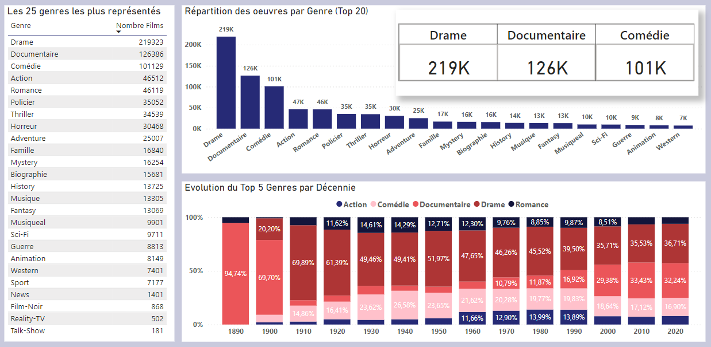
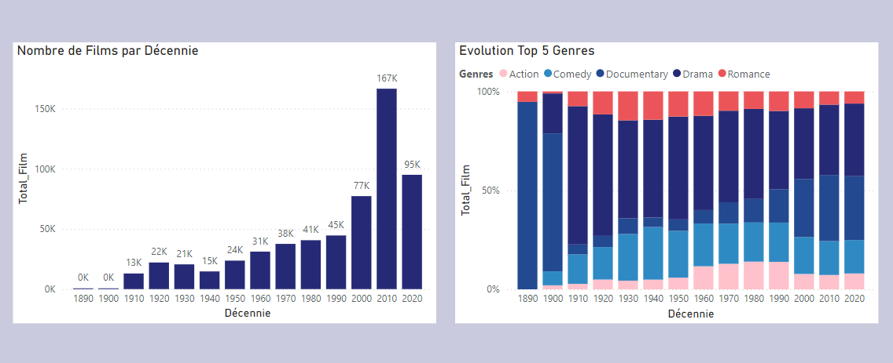
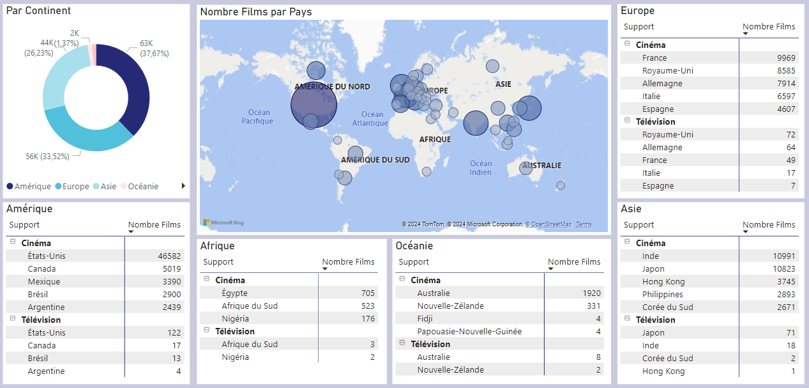
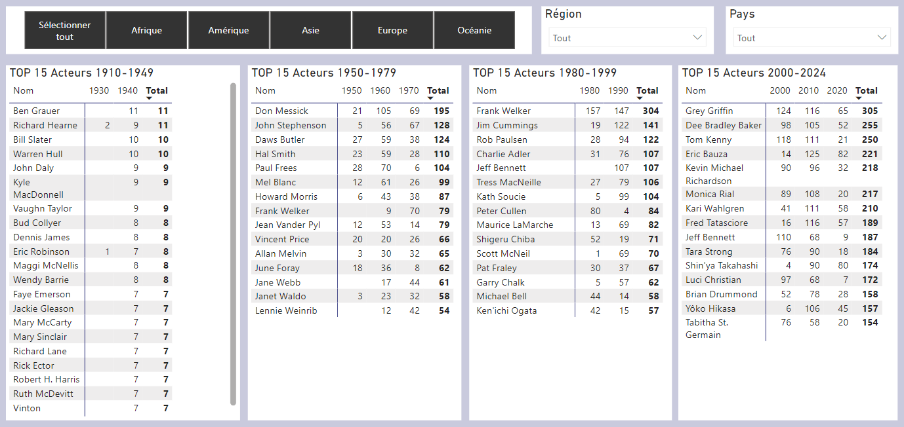

# Analyse des KPI et Visualisation

## 🎯 Objectifs de l'analyse
L'objectif de ce projet est d'explorer les bases de données IMDb et TMDb afin d'en tirer des insights pertinents à l'aide de visualisations PowerBI.

Les analyses porteront sur :

1. **Vue générale des bases de données (Oeuvres, Supports, Genres, Pays)**
2. **L'identification des acteurs les plus présents et les périodes associées.**
3. **L'évolution de la durée moyenne des films au fil des années.**
4. **La comparaison entre les acteurs présents au cinéma et dans les séries.**
5. **L'âge moyen des acteurs.**
6. **Les films les mieux notés et les caractéristiques qu'ils partagent.**

---

## 📋 Méthodologie
### Étapes clés :

1. **Préparation des données :**
   - Nettoyage des datasets IMDb et TMDb pour éliminer les doublons et les valeurs manquantes.
   - Standardisation des formats de colonnes (dates, durées, notes, etc.).
   - Fusion des datasets pour enrichir les analyses (liens entre acteurs, films et séries).

2. **Exploration et création des KPI :**
   - Définition des indicateurs à suivre pour répondre aux objectifs.
   - Extraction et transformation des données nécessaires.

3. **Construction des visualisations Power BI :**
   - Création de rapports dynamiques et interactifs.
   - Mise en place de filtres et slicers pour explorer les données en détail.

---

##  **Schéma de liaison des Tables sur Power BI**
---

## Périmètre d'analyse

- ***Cinéma*** : Tous les films - hors Court Métrages
- ***Télévision*** : Uniquement TVSeries
- **Suppression des Films et Séries pour Adulte**

---

##  **📊 KPI** : Vue générale des bases de données

### Nombre d'oeuvres par supports, Ratio et Evolution par Décennie
 

***Source : ImdB title.basics***

- Nombre total d'oeuvres (hors films Adulte) : ***834 859***
- Ratio des Supports : ***70,3% Cinéma, 29,7% Télévision***
- **Evolution dans le temps** :
  - Le cinéma connait une première période de croissance entre les 2 guerres mondiales, puis connait à partir des années 2000 une très forte croissance consécutive à l'***explosion*** d'internet et l'apparition des Platformes de Streaming.
  - La télévision ***suit cette courbe*** à partir de 1950, dans une moindre mesure.
- Le nombre d'oeuvres cinématographiques restent pour chaque décennie **entre 40 et 50% supérieur** au nombre de Séries télévisées.

---

### Fréquences des Films par Genre
 

***Source : ImdB title.basics***

- 3 Genres (Drame, Documentaire, Comédie) représentent ***72% des films***
- Le ***documentaire*** est particulièrement présent dans la base de données.

---

### Evolution du nombre de Films dans le temps
 

***Source : ImdB title.basics***

- Les 3 décennies les plus prolifiques sont ***2000s, 2010s, 2020s***
- Depuis les années 2000, le ***documentaire*** est en forte expansion.
- Les années prolifiques pour le film d'Action sont entre ***1960 et 2000***

---
### Répartition des Films par Pays
 

***Source : TmdB Full***

---
### Films les mieux notés

#### Top 10 des films les mieux notés par Continent
 

##  **📊 KPI** : Analyse des acteurs dans la base de données

### Nombre d'acteurs au cinéma, à la télévision par décennie
 

***Source : ImdB title.basics / name.basics***

- Entre 1950 et 2000, le nombre d'acteurs au cinéma et à la télévision est en croissance constante, en raison du développement mondial.
- A partir des années 2000, la croissance s'accélère; le nombre d'acteurs doublant pour chaque décennie pour atteindre **576K** acteurs dans les années 2010 pour le cinéma, et **340K** pour la télévision. Cela s'explique par le **démocratisation d'internet et des supports numériques** d'une part, et par l'apparition à partir de 2010 des **plateformes de Streaming**.

---

### Identification des acteurs les plus présents et les périodes associées

#### Périmètre 
- Nous analysons la période 1950 - 2024 ;

#### Au cinéma

***Source : ImdB title.basics / name.basics***

#### A la télévision

***Source : ImdB title.basics / name.basics***

### 2. Évolution de la durée moyenne des films au fil des années
- **KPI :** Durée moyenne par décennie ou année.
- **Visualisation :**
  - Graphique en courbes montrant l'évolution au fil des décennies.
  - Histogramme pour une répartition plus détaillée.

### 3. Comparaison entre les acteurs présents au cinéma et dans les séries
- **KPI :** Proportion d'acteurs présents dans les films, les séries ou les deux.
- **Visualisation :**
  - Diagramme de Venn ou un graphique en barres empilées.
  - Tableau croisé dynamique pour une exploration plus fine.

### 4. Âge moyen des acteurs
- **KPI :** Calcul de l'âge moyen des acteurs par période et par genre (homme/femme).
- **Visualisation :**
  - Graphique en barres pour la moyenne par décennie.
  - Carte de chaleur pour explorer la répartition par âge et genre.

### 5. Les films les mieux notés et les caractéristiques qu'ils partagent
- **KPI :** Moyenne des notes des films, analyse des caractéristiques communes (genres, réalisateurs, durée, année de sortie).
- **Visualisation :**
  - Tableau récapitulatif des films les mieux notés.
  - Graphique en bulles pour explorer les corrélations (durée, notes, genres).

---

## Livrables
1. Rapport Power BI complet avec :
   - Dashboard interactif.
   - Pages dédiées pour chaque KPI.

2. Documentation expliquant les étapes suivies, les transformations effectuées et les sources des données.

---

## Conclusion
Cette analyse permettra d'extraire des insights clés sur les tendances des acteurs, les films, et les séries, tout en mettant en avant les outils de visualisation Power BI pour une compréhension claire et efficace des données.

