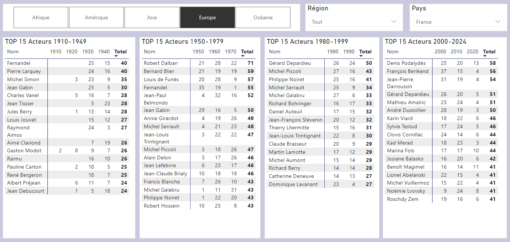
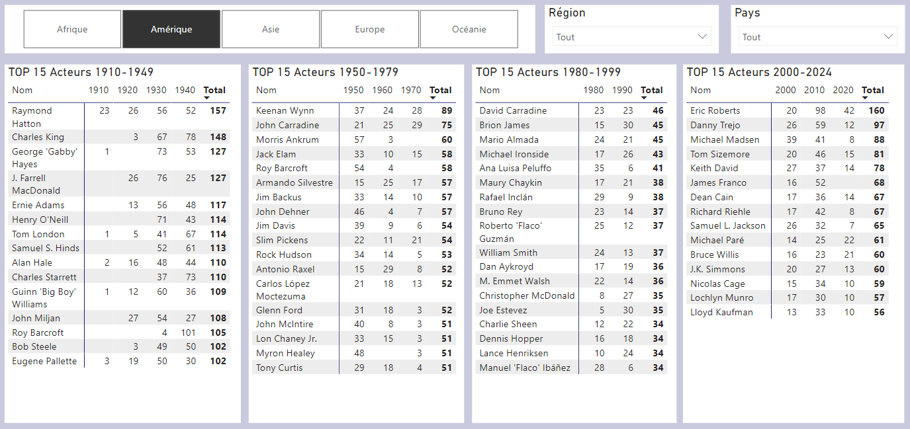
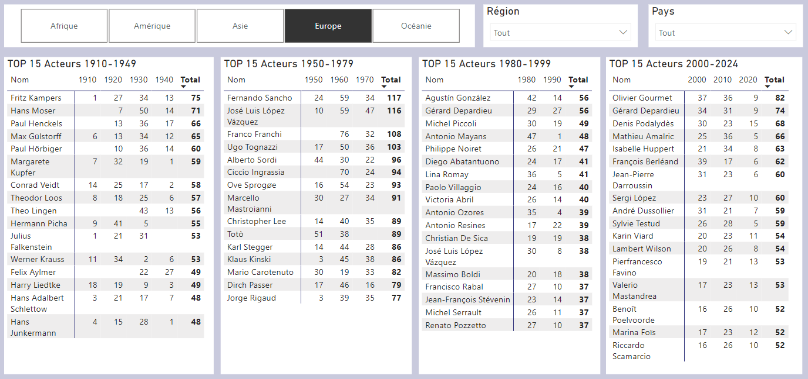
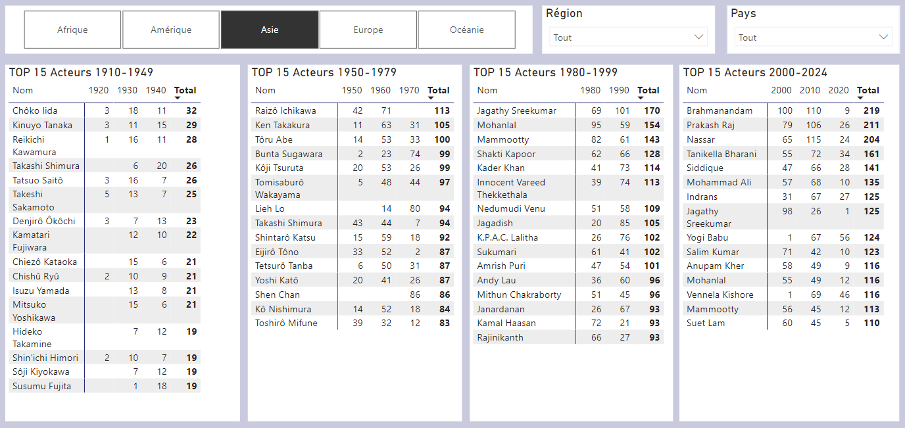
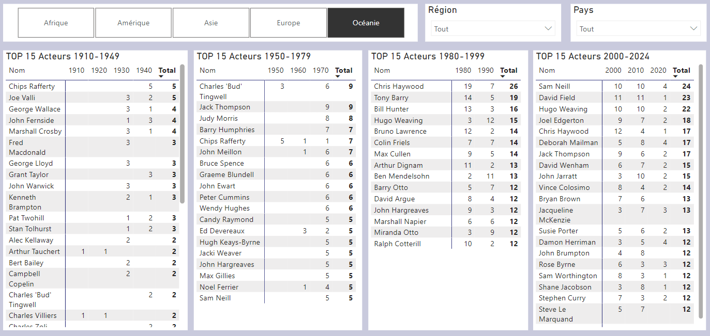
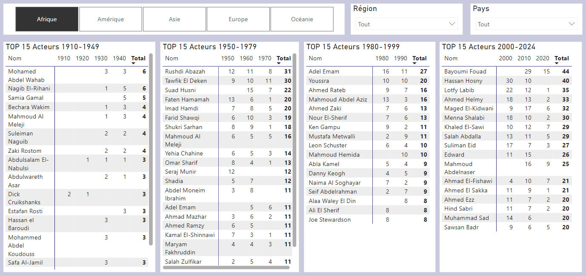

# Analyse des KPI et Visualisation

## 🎯 Objectifs de l'analyse
L'objectif de ce projet est d'explorer les bases de données IMDb et TMDb afin d'en tirer des insights pertinents à l'aide de visualisations PowerBI.

Couplés à l'Etude de Marché précédemment réalisée, ces insights nous permettront de définir l'orientation stratégique pour la suite du projet et nos choix quant aux sélections d'oeuvres pour le moteur de recommandation.

Les principales analyses du dashboard présenteront :

1. **La vue générale des bases de données (Oeuvres, Supports, Genres, Pays)**
2. **Les films les mieux notés et les caractéristiques qu'ils partagent.**
3. **L'évolution de la durée moyenne des films au fil des années.**
4. **L'identification des acteurs les plus présents et les périodes associées.**
5. **La comparaison entre les acteurs présents au cinéma et dans les séries.**
6. **L'âge moyen des acteurs.** 

---

## 📋 Méthodologie
### Étapes clés :

1. **Préparation des données :**
   - Nettoyage des datasets IMDb et TMDb pour éliminer les doublons et les valeurs manquantes.
   - Standardisation des formats de colonnes (dates, durées, notes, etc.).
   - Fusion des datasets pour enrichir les analyses (liens entre acteurs, films et séries).

2. **Exploration et création des KPI :**
   - Définition des indicateurs à suivre pour répondre aux objectifs.
   - Extraction et transformation des données nécessaires.

3. **Construction des visualisations Power BI :**
   - Création de rapports dynamiques et interactifs.
   - Mise en place de filtres et slicers pour explorer les données en détail.

---

##  **Schéma de liaison des Tables sur Power BI**
---

## Périmètre d'analyse

- ***Cinéma*** : Tous les films - hors Court Métrages
- ***Télévision*** : Uniquement TVSeries
- **Suppression des Films et Séries pour Adulte**

---

##  **📊 KPI** : Vue générale des bases de données
 

### Nombre d'oeuvres par supports, Durée Moyenne et Evolution par Décennie
 

***Source : ImdB title.basics***
 

#### Analyse
- **Nombre total d'œuvres (hors films adultes)** : ***834 859***, dont ***587 074*** pour le Cinéma et ***247 785*** pour la Télévision.  
- **Répartition des supports** : ***70,3 % Cinéma*** et ***29,7 % Télévision***.  
- **Évolution temporelle des œuvres** :  
  - **1890 à 1949** : Augmentation progressive des œuvres cinématographiques avec un pic dans les années 1920-1930 (~22K à 21K films). La télévision est quasi absente.  
  - **1950 à aujourd'hui** : Explosion significative du nombre d’œuvres, notamment dans les années 2010 avec un maximum de ***167K films***. La Télévision montre une croissance régulière, atteignant un pic en ***2020 (50K séries)***.  
- **Durée moyenne des films et séries** :  
  - Films (Cinéma) : ***1h30 (90 minutes)*** en moyenne, stable depuis les années 1950.  
  - Séries (Télévision) : ***46 minutes*** en moyenne, mais avec des variations importantes au fil des décennies.  

#### Insights pertinents
- La forte proportion de films dans la base (70,3 %) favorise le développement d’un moteur de recommandation axé sur le Cinéma.  
- La période récente (2000 à aujourd'hui) est la plus productive en termes de contenu, ce qui suggère **une orientation sur les œuvres contemporaines pour répondre aux attentes des utilisateurs**.  
- La stabilité de la durée moyenne des films (90 minutes) et des séries (46 minutes) est un indicateur clé pour **ajuster les recommandations en fonction de la disponibilité des utilisateurs** (Programmation de **"binge-watch" ou d'œuvres courtes** avec thématiques (ex : ***Nuit Walking Dead***)).  
 

---

### Analyse des Genres au Cinéma
 

***Source : ImdB title.basics***
 

#### **Répartition globale des genres :**
- **Top 5 genres les plus représentés** :  
  - **Drame** : ***42,33 %*** des films (219 323 œuvres).  
  - **Documentaire** : ***24,39 %*** (126 386 œuvres).  
  - **Comédie** : ***19,52 %*** (101 129 œuvres).  
  - **Action** : ***8,98 %*** (46 512 œuvres).  
  - **Romance** : ***8,90 %*** (46 119 œuvres).

#### **Évolution des genres par décennie (Top 5) :**
1. **1890-1920** :  
   - Le **Drame** domine massivement avec des parts atteignant jusqu'à ***94,74 %*** (années 1890).  
   - La **Comédie** commence à émerger dès les années 1910 avec ***20,20 %*** des productions.  

2. **1920-1960** :  
   - Déclin progressif du **Drame**, mais il reste le genre dominant (~***47,65 %*** dans les années 1960).  
   - **Documentaire** et **Comédie** s'imposent durablement, atteignant respectivement ***23,62 %*** (1940) et ***14,86 %*** (1920).  

3. **1970-2020** :  
   - Stabilisation des parts de marché :  
      - **Drame** : entre ***35 % et 36,71 %*** des productions.  
      - **Comédie** : en légère baisse, mais reste un genre clé (~***16-17 %***).  
   - Croissance de l'**Action** et apparition d'autres genres contemporains (Sci-Fi, Thriller).

#### Insights pertinents :
- **Évolution des tendances** :  
  - Jusqu'à 1920, **les films sont principalement des drames**. Avec l'avènement du cinéma parlant, d'autres genres, **comme la Comédie et le Documentaire**, s'imposent.  
  - La diversification des genres devient évidente à partir des années 1950, avec **une part croissante des films d'Action et de Romance**.  

- **Recommandation :**  
  - Pour un moteur de recherche et/ou une programmation de Cinéma, il peut être pertinent de créer des **filtres orientés vers les genres dominants de chaque décennie pour une expérience utilisateur adaptée**.
 

---

### Analyse des Genres dans les Séries TV
 

***Source : ImdB title.basics***
 

#### **Répartition globale des genres :**
- **Top 5 des genres les plus représentés** :  
  1. **Drame** : ***35,12 %*** des séries.  
  2. **Comédie** : ***24,84 %***.  
  3. **Documentaire** : ***14,56 %***.  
  4. **Animation** : ***8,23 %***.  
  5. **Action** : ***7,45 %***.  

#### **Genres minoritaires :**
- Les genres tels que **Talk-Show (0,12 %)**, **Reality-TV (0,15 %)**, et **Western (0,65 %)** sont parmi les moins représentés.

#### **Évolution des genres par décennie (Top 5) :**
1. **1950-1960** :  
   - **Drame** : prédominant avec une part atteignant jusqu'à ***45 %***.  
   - **Comédie** : en croissance, représentant environ ***30 %*** des séries.  
   - **Documentaire** : émerge avec environ ***10 %***.  

2. **1970-1990** :  
   - **Drame** : stable autour de ***40 %***.  
   - **Comédie** : légère baisse, oscillant entre ***25 %*** et ***28 %***.  
   - **Animation** : apparition notable, atteignant environ ***10 %***.  

3. **2000-2020** :  
   - **Drame** : augmentation significative, culminant à plus de ***50 %***.  
   - **Comédie** : déclin progressif, descendant à environ ***20 %***.  
   - **Documentaire** : croissance continue, atteignant près de ***15 %***.  
   - **Action** : émergence notable, représentant environ ***10 %***.  
   - **Animation** : stable autour de ***8 %***.

#### Insights pertinents
- **Tendances générales** :  
  - Le **Drame** demeure le genre dominant, avec une croissance notable au cours des dernières décennies.  
  - La **Comédie** connaît une baisse relative, bien qu'elle reste un genre majeur.  
  - Les genres **Documentaire**, **Animation**, et **Action** affichent une progression constante, reflétant une diversification des préférences du public.  

- **Recommandations** :  
  - Pour le développement d'un moteur de recommandation, il serait judicieux de mettre l'accent sur les genres **Drame** et **Comédie**, tout en intégrant des options pour les genres en croissance tels que **Documentaire**, **Animation**, et **Action**.  
  - Adapter les recommandations en fonction des tendances par décennie pourrait améliorer l'engagement des utilisateurs, en proposant des séries correspondant aux évolutions historiques des préférences.  
 

---

### Répartition des Films par Pays
 

***Source : TmdB***
 

#### **Top 5 des pays contributeurs (Cinéma uniquement)**  

1. **États-Unis** :  
   - En tête avec une production écrasante, représentant la majorité des œuvres cinématographiques.  
   - Les États-Unis dominent grâce à Hollywood, qui est un moteur mondial pour les blockbusters, les franchises populaires et les films d’animation.  

2. **Inde** :  
   - Deuxième plus grand contributeur, principalement à travers Bollywood.  
   - L’Inde produit un volume colossal de films chaque année, axés sur la musique, la danse et des récits épiques qui séduisent une audience mondiale et locale.  

3. **Royaume-Uni** :  
   - Le Royaume-Uni occupe la troisième place, avec des films qui allient souvent qualité artistique et succès critique.  
   - Les productions britanniques se distinguent par leur richesse culturelle et historique, en particulier dans les drames et les adaptations littéraires.  

4. **France** :  
   - Acteur majeur du cinéma mondial, reconnu pour ses comédies sophistiquées, ses drames et ses films d’auteur.  
   - La France conserve une influence notable grâce à son identité cinématographique forte et son soutien institutionnel.  

5. **Japon** :  
   - Cinquième contributeur, le Japon est un acteur incontournable, en particulier pour son cinéma d’animation (*anime*) qui s’exporte largement.  
   - Les œuvres japonaises sont uniques et captivantes, mêlant souvent récits fantastiques et explorations émotionnelles.  

---

#### **Analyse par continent (Top 3)** :
1. **Amérique du Nord** :  
   - ***Plus de 60 %*** des œuvres proviennent de ce continent.  
   - Hollywood reste un pôle incontournable pour le cinéma mondial, tandis que les productions canadiennes apportent un complément qualitatif.  

2. **Europe** :  
   - ***Environ 20 %*** des œuvres.  
   - L’Europe offre des productions diversifiées : cinéma d’auteur, comédies légères, films historiques et drames puissants.  

3. **Asie** :  
   - ***Environ 10 %*** des œuvres, avec une dominance de l’Inde et du Japon.  
   - On remarque une montée en puissance des contenus coréens, qui séduisent un public international.  

#### **Insights pertinents :**

##### **1. Un filtre géographique pertinent dans le moteur de recherche :**
Pour améliorer l’expérience utilisateur et attirer plus de spectateurs, intégrer des filtres géographiques dans un moteur de recherche pourrait être stratégique :  
- **Exemple de filtres** :  
  - *Par pays* : États-Unis, Royaume-Uni, France, Inde, Japon.  
  - *Par continent* : Amérique du Nord, Europe, Asie.  
- Cela permettrait aux cinéphiles de découvrir facilement des œuvres correspondant à une culture ou une région d’intérêt.  

##### **2. Programmation adaptée selon les attentes culturelles :**
En analysant les données géographiques, le cinéma peut mettre en avant des thématiques ou cycles spécifiques, en fonction des attentes du public :  

- **Amérique du Nord** :  
  - Proposer des blockbusters ou des films à gros budgets pour attirer un public large (ex. : films Marvel, thrillers américains).  

- **Europe** :  
  - Organiser des *soirées cinéma d’auteur* ou des projections de comédies françaises, britanniques ou italiennes.  
  - Valoriser des productions indépendantes européennes qui plaisent aux spectateurs recherchant un contenu plus intimiste.  

- **Asie** :  
  - Lancer des événements spécifiques, comme des *projections de films Bollywood*, *soirées animation japonaise* ou marathons de *dramas coréens*.  
  - Les œuvres asiatiques, bien que minoritaires, attirent souvent des spectateurs passionnés.  

##### **3. Événements thématiques autour des régions dominantes :**
Proposer des cycles régionaux pourrait permettre de diversifier l’offre et fidéliser une audience plus ciblée. Voici quelques idées :  
- **Semaine américaine** : blockbusters, thrillers, séries cultes.  
- **Focus européen** : comédies françaises, drames britanniques, cinéma d’auteur espagnol.  
- **Festival asiatique** : Bollywood, films japonais (ex. *Your Name*), œuvres coréennes primées (*Parasite*).  

##### **4. Optimisation des recommandations géographiques :**
Dans un moteur de recherche, enrichir les recommandations en fonction des pays ou continents dominants permettrait de répondre à des attentes précises :  
- Exemple : si un spectateur choisit *cinéma asiatique*, afficher des œuvres indiennes, japonaises ou coréennes, triées par popularité ou critiques.  

#### **Recommandations spécifiques pour le cinéma :**

1. **Mettre en avant les productions américaines et européennes :**  
   - Elles représentent la majorité des œuvres et répondent à un large éventail de goûts.  

2. **Accentuer la diversité avec des productions asiatiques :**  
   - Intégrer régulièrement des films Bollywood, des animations japonaises ou des thrillers coréens pour séduire un public curieux.  

3. **Créez des cycles et festivals régionaux :**  
   - Offrir des expériences immersives avec des projections et événements thématiques (*Semaine Bollywood*, *Cycle cinéma britannique*).  

4. **Enrichissez le moteur de recherche :**  
   - Ajouter des catégories géographiques claires pour permettre une exploration facile des œuvres par pays ou continent.  
 

---

### Films les mieux notés et leurs caractéristiques
 

#### Top Films 1920 - 1949

***Source : ImdB - TmdB***
 

#### Analyse

- **Top 10 des films selon la note moyenne** :
Les films les mieux notés de cette période incluent des classiques intemporels qui ont marqué l'histoire du cinéma.
Ils sont souvent issus de réalisateurs de renom et bénéficient d'une reconnaissance critique exceptionnelle.
Les genres semblent variés (drame, film noir, comédie romantique).
La majorité des films provient des États-Unis, soulignant l'impact d'Hollywood dès ses débuts.

- **Top 10 selon le nombre de votes** :
Ces films ont une notoriété massive auprès des spectateurs, même aujourd'hui.
La popularité peut être attribuée à des rééditions, des restaurations, ou à une présence régulière dans des rétrospectives ou plateformes de streaming.
Les genres incluent des drames et des films emblématiques souvent étudiés dans les écoles de cinéma.
Là encore, une forte représentation des films américains est notable.

#### Insights pertinents

- **Pour le moteur de recherche** :

Intégrer un filtre spécifique pour les films classiques (années 1920-1949), afin de valoriser cette période.
Inclure des classements selon les deux métriques principales (note et votes), permettant aux spectateurs de choisir entre qualité critique et popularité.
Proposer une catégorie dédiée pour les réalisateurs emblématiques de cette période (Hitchcock, Chaplin, etc.).

- **Pour la programmation cinéma** :

Focus sur les films les mieux notés : Ces œuvres attireraient un public de cinéphiles cherchant à découvrir ou redécouvrir des classiques peu accessibles en salle.
Mise en avant des films les plus votés : Ils garantissent une forte attractivité, notamment grâce à leur popularité persistante et leur impact culturel.
Organiser des cycles thématiques : Proposer des rétrospectives par réalisateur ou par genre dominant (ex. : film noir, comédie romantique, drame).
Prévoir des projections restaurées ou accompagnées de présentations pour enrichir l’expérience et l’intérêt historique.
 

---

#### Top Films 1950-1979

***Source : ImdB - TmdB***
 

#### Analyse

1. **Top 10 des films selon la note moyenne :**  
   - Les films de cette période incluent des chefs-d’œuvre incontournables qui ont façonné le cinéma moderne.  
   - Les genres dominants sont variés : drame, science-fiction, thriller et comédie.  
   - Les réalisateurs comme Stanley Kubrick, Akira Kurosawa ou Sergio Leone sont fortement représentés, soulignant leur importance artistique.  
   - Hollywood reste dominant, mais l'influence internationale se fait plus marquée (notamment le Japon et l'Europe).  

2. **Top 10 selon le nombre de votes :**  
   - Ces films, largement populaires, ont un impact culturel énorme qui perdure encore aujourd’hui.  
   - On observe une surreprésentation des blockbusters et des œuvres cultes (notamment des films de science-fiction ou de fantasy).  
   - Les sagas et franchises emblématiques commencent à émerger dans cette période (ex. : *Star Wars*).  

#### **Insights pertinents**  

1. **Pour le moteur de recherche :**  
   - Ajouter une section pour les œuvres de 1950 à 1979, avec la possibilité de filtrer par *note* ou *nombre de votes*.  
   - Proposer des recommandations par réalisateurs emblématiques de cette période (Kubrick, Kurosawa, Leone, Fellini).  
   - Inclure un filtre pour les œuvres ayant marqué des genres spécifiques (sci-fi, western spaghetti, drame psychologique).  

2. **Pour la programmation cinéma :**  
   - **Focus sur les films les mieux notés :** Organiser des soirées « chefs-d’œuvre », ciblant les cinéphiles à la recherche de films reconnus pour leur qualité artistique.  
   - **Films les plus votés :** Mettre en avant des blockbusters cultes pour attirer un public plus large, nostalgique des classiques populaires.  
   - **Cycles par genres et réalisateurs :** Par exemple :  
     - Cycle *Stanley Kubrick* avec des projections comme *2001, l’Odyssée de l’Espace* ou *Orange Mécanique*.  
     - Cycle *westerns spaghetti* avec les œuvres de Sergio Leone (*Le Bon, la Brute et le Truand*).  
   - **Événements interactifs :** Ajouter des débats ou des analyses post-projection pour renforcer l’expérience culturelle.  

Cette période, riche en innovations et en classiques incontournables, est idéale pour séduire à la fois un public cinéphile et des amateurs de blockbusters. Le moteur de recherche et la programmation cinéma peuvent ainsi valoriser la diversité et l’impact des films de cette époque.

---

#### Top Films 1980-1999

***Source : ImdB - TmdB***
 

#### Analyse

1. **Top 10 des films selon la note moyenne :**  
   - Cette période est marquée par des œuvres devenues des références culturelles, notamment dans les genres du drame, du thriller psychologique et de la science-fiction.  
   - Les films de cette liste, comme *The Shawshank Redemption* (*Les Évadés*), *Pulp Fiction* ou *Schindler's List*, témoignent d'une période où le storytelling puissant et la profondeur émotionnelle sont au premier plan.  
   - Les réalisateurs de renom comme Steven Spielberg, Quentin Tarantino et David Fincher dominent avec des chefs-d'œuvre intemporels.  
   - Les films internationaux gagnent également en reconnaissance, notamment à travers des productions plus accessibles pour un public mondial.

2. **Top 10 selon le nombre de votes :**  
   - Les films les plus votés de cette période incluent des blockbusters emblématiques tels que *The Matrix*, *The Lord of the Rings* (précurseur avec *The Fellowship of the Ring*) et des films de science-fiction comme *Terminator 2*.  
   - Le cinéma d'action et les franchises dominent le classement, reflétant une explosion des films orientés grand public et le début de l'ère des superproductions à gros budget.  
   - Ces films continuent de bénéficier de vastes communautés de fans, notamment grâce à Internet et aux plateformes comme IMDb.  

#### **Insights pertinents**

1. **Pour le moteur de recherche :**  
   - Ajouter une option spécifique pour explorer les films des années 1980-1999, avec des filtres par *note moyenne* et *popularité* (nombre de votes).  
   - Inclure des catégories par réalisateurs marquants (Tarantino, Spielberg, James Cameron, les Wachowski) pour permettre un ciblage des recherches par affinité cinématographique.  
   - Mettre en avant les sagas et franchises majeures de cette période, notamment pour attirer les fans nostalgiques de ces œuvres.  

2. **Pour la programmation cinéma :**  
   - **Soirées Blockbusters des années 80-90 :** Créer un événement dédié aux superproductions cultes (*Terminator 2*, *Jurassic Park*, *The Matrix*), pour raviver l'intérêt des fans de science-fiction et d'action.  
   - **Hommage aux drames intemporels :** Diffuser des œuvres comme *Les Évadés* ou *Schindler's List* dans un cadre cinéphile avec des analyses ou des débats après projection.  
   - **Cycles thématiques par réalisateur :**  
     - Un cycle Spielberg pour découvrir sa contribution au cinéma (action, drame, aventure).  
     - Un cycle Tarantino avec des films comme *Pulp Fiction* et *Reservoir Dogs*.  
   - **Événements intergénérationnels :** Mettre en avant des films familiaux iconiques de cette période (*E.T.*, *The Lion King*) pour réunir un public de tout âge.  

Cette période, riche en superproductions et en récits emblématiques, est parfaite pour satisfaire une audience diversifiée : des fans de blockbusters, des cinéphiles à la recherche de récits profonds, et des nostalgiques des classiques des années 80-90. Le moteur de recherche et la programmation peuvent ainsi s'adapter aux attentes variées de ce public.

---

#### Top Films 1980-1999

***Source : ImdB - TmdB***
 

#### Analyse

---

##  **📊 KPI** : Analyse des acteurs dans la base de données

### Nombre d'acteurs au cinéma, à la télévision par décennie
 

***Source : ImdB title.basics / name.basics***

- Entre 1950 et 2000, le nombre d'acteurs au cinéma et à la télévision est en croissance constante, en raison du développement mondial.
- A partir des années 2000, la croissance s'accélère; le nombre d'acteurs doublant pour chaque décennie pour atteindre **576K** acteurs dans les années 2010 pour le cinéma, et **340K** pour la télévision. Cela s'explique par le **démocratisation d'internet et des supports numériques** d'une part, et par l'apparition à partir de 2010 des **plateformes de Streaming**.

### Comparaison entre les acteurs présents au cinéma et dans les séries
- **KPI :** Proportion d'acteurs présents dans les films, les séries ou les deux.
- **Visualisation :**
  - Diagramme de Venn ou un graphique en barres empilées.
  - Tableau croisé dynamique pour une exploration plus fine.

---

### Identification des acteurs les plus présents et les périodes associées

#### Périmètre 
- Nous analysons la présence des acteurs selon le ***nombre d'apparitions*** dans les films. Le classement est établi sur le ***Top 15***.
- L'analyse est faite par continent de production des films / séries. Dans le rapport, l'analyse peut être filtrée par pays également.
- Les visuels ci dessous montrent un échantillon des analyses possibles.
- L'analyse est construite selon les grandes périodes du cinéma :
  - 1910-1949 : Du cinéma muet jusqu'à l'après guerre
  - 1950-1979 : L'age d'or d'Hollywood et le développement du cinéma et de la télévision
  - 1980-1999 : La démocratisation de la télévision et les débuts de la mondialisation
  - 2000-2024 : L'explosion d'internet, l'apparition des plateformes de Streaming
- Un focus est fait sur le ***Cinéma Français***

#### Au cinéma

##### Top 15 Acteurs en France

##### Top 15 Acteurs en Amérique

##### Top 15 Acteurs en Europe

##### Top 15 Acteurs en Asie

##### Top 15 Acteurs en Océanie

##### Top 15 Acteurs en Afrique

***Source : ImdB title.basics / name.basics***

#### A la télévision

***Source : ImdB title.basics / name.basics***

### 4. Âge moyen des acteurs
- **KPI :** Calcul de l'âge moyen des acteurs par période et par genre (homme/femme).
- **Visualisation :**
  - Graphique en barres pour la moyenne par décennie.
  - Carte de chaleur pour explorer la répartition par âge et genre.

### 5. Les films les mieux notés et les caractéristiques qu'ils partagent
- **KPI :** Moyenne des notes des films, analyse des caractéristiques communes (genres, réalisateurs, durée, année de sortie).
- **Visualisation :**
  - Tableau récapitulatif des films les mieux notés.
  - Graphique en bulles pour explorer les corrélations (durée, notes, genres).

---

## Livrables
1. Rapport Power BI complet avec :
   - Dashboard interactif.
   - Pages dédiées pour chaque KPI.

2. Documentation expliquant les étapes suivies, les transformations effectuées et les sources des données.

---

## Conclusion
Cette analyse permettra d'extraire des insights clés sur les tendances des acteurs, les films, et les séries, tout en mettant en avant les outils de visualisation Power BI pour une compréhension claire et efficace des données.

Pourquoi un cinéma devrait intégrer des séries TV dans sa programmation ou son moteur de recherche ?
Opportunités commerciales :

    Attirer de nouveaux publics :
        Les séries TV ont gagné en popularité ces dernières années, notamment grâce aux plateformes de streaming. Intégrer des séries permettrait d’attirer des spectateurs qui recherchent des formats narratifs longs et immersifs.
        Proposer des marathons ou des projections d’épisodes spéciaux de séries cultes (Drame, Action, ou Comédie) peut séduire un public jeune et les fans de franchises.

    Diversifier l’offre de contenu :
        Les Documentaires et les Animations pourraient être utilisés pour organiser des événements thématiques (éducation, culture pop, etc.).
        Les genres comme Action ou Science-fiction, bien qu’en minorité, sont des atouts pour des projections à thème ou des collaborations avec des festivals.

    Créer de l’engagement :
        Organiser des avant-premières de séries très attendues ou des projections d’épisodes de fin de saison peut fidéliser le public.
        Les projections spéciales permettent de créer une expérience communautaire autour des séries (fans clubs, cosplay, débats).

Avantages d’un moteur de recherche incluant les séries TV :

    Meilleure personnalisation : Enrichir un moteur de recherche avec des séries permettrait de répondre aux goûts variés des spectateurs. Par exemple :
        Recommander des séries Comédie ou Drame pour les amateurs de récits légers ou intenses.
        Proposer des Documentaires ou des séries Historiques pour des publics cherchant un contenu éducatif ou culturel.

    Cross-content : Créer des ponts entre séries et films basés sur des genres communs ou des acteurs partagés.
        Exemple : Un spectateur ayant apprécié un film dramatique pourrait être tenté par une série TV similaire.
