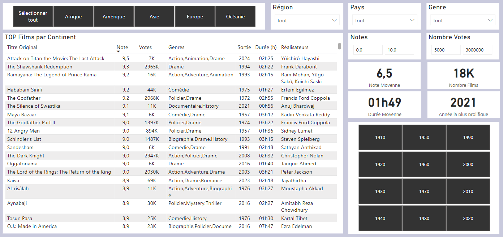
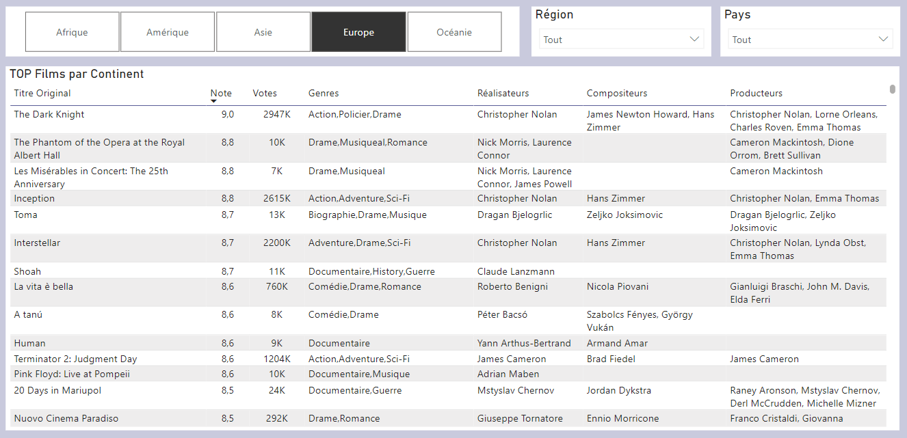
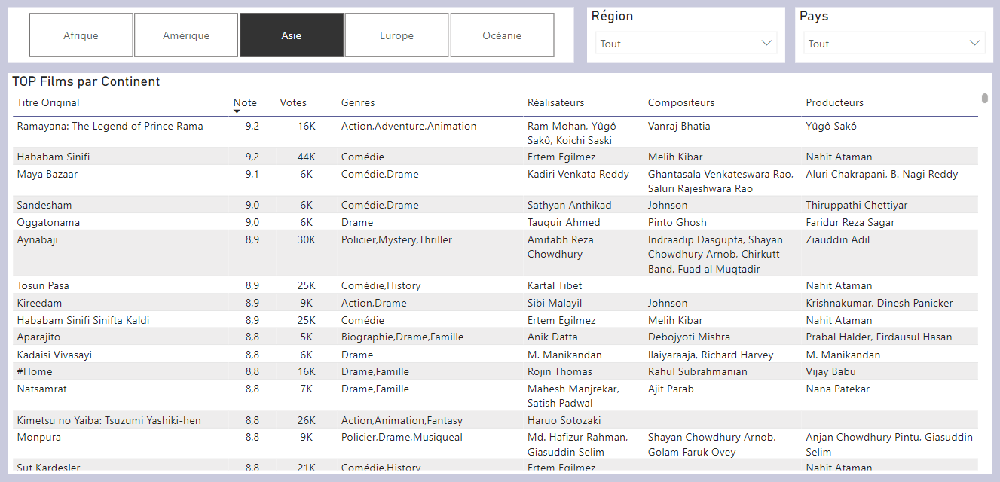
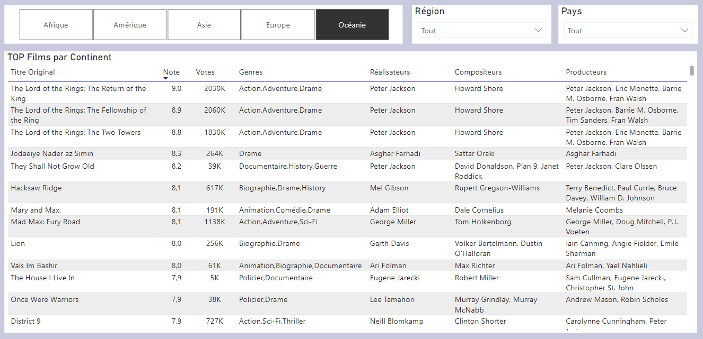
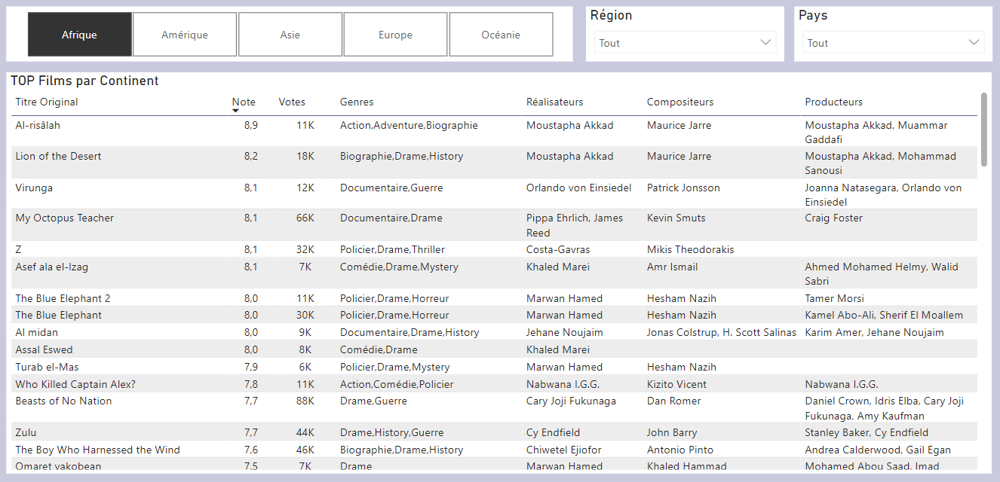

# Analyse des KPI et Visualisation

## 🎯 Objectifs de l'analyse
L'objectif de ce projet est d'explorer les bases de données IMDb et TMDb afin d'en tirer des insights pertinents à l'aide de visualisations PowerBI.

Couplés à l'Etude de Marché précédemment réalisée, ces insights nous permettront de définir l'orientation stratégique pour la suite du projet et nos choix quant aux sélections d'oeuvres pour le moteur de recommandation.

Les principales analyses du dashboard présenteront :

1. **La vue générale des bases de données (Oeuvres, Supports, Genres, Pays)**
2. **Les films les mieux notés et les caractéristiques qu'ils partagent.**
3. **L'évolution de la durée moyenne des films au fil des années.**
4. **L'identification des acteurs les plus présents et les périodes associées.**
5. **La comparaison entre les acteurs présents au cinéma et dans les séries.**
6. **L'âge moyen des acteurs.** 

---

## 📋 Méthodologie
### Étapes clés :

1. **Préparation des données :**
   - Nettoyage des datasets IMDb et TMDb pour éliminer les doublons et les valeurs manquantes.
   - Standardisation des formats de colonnes (dates, durées, notes, etc.).
   - Fusion des datasets pour enrichir les analyses (liens entre acteurs, films et séries).

2. **Exploration et création des KPI :**
   - Définition des indicateurs à suivre pour répondre aux objectifs.
   - Extraction et transformation des données nécessaires.

3. **Construction des visualisations Power BI :**
   - Création de rapports dynamiques et interactifs.
   - Mise en place de filtres et slicers pour explorer les données en détail.

---

##  **Schéma de liaison des Tables sur Power BI**
---

## Périmètre d'analyse

- ***Cinéma*** : Tous les films - hors Court Métrages
- ***Télévision*** : Uniquement TVSeries
- **Suppression des Films et Séries pour Adulte**

---

##  **📊 KPI** : Vue générale des bases de données
 

### Nombre d'oeuvres par supports, Durée Moyenne et Evolution par Décennie
 

***Source : ImdB title.basics***
 

#### Analyse
- **Nombre total d'œuvres (hors films adultes)** : ***834 859***, dont ***587 074*** pour le Cinéma et ***247 785*** pour la Télévision.  
- **Répartition des supports** : ***70,3 % Cinéma*** et ***29,7 % Télévision***.  
- **Évolution temporelle des œuvres** :  
  - **1890 à 1949** : Augmentation progressive des œuvres cinématographiques avec un pic dans les années 1920-1930 (~22K à 21K films). La télévision est quasi absente.  
  - **1950 à aujourd'hui** : Explosion significative du nombre d’œuvres, notamment dans les années 2010 avec un maximum de ***167K films***. La Télévision montre une croissance régulière, atteignant un pic en ***2020 (50K séries)***.  
- **Durée moyenne des films et séries** :  
  - Films (Cinéma) : ***1h30 (90 minutes)*** en moyenne, stable depuis les années 1950.  
  - Séries (Télévision) : ***46 minutes*** en moyenne, mais avec des variations importantes au fil des décennies.  

#### Insights pertinents
- La forte proportion de films dans la base (70,3 %) favorise le développement d’un moteur de recommandation axé sur le Cinéma.  
- La période récente (2000 à aujourd'hui) est la plus productive en termes de contenu, ce qui suggère **une orientation sur les œuvres contemporaines pour répondre aux attentes des utilisateurs**.  
- La stabilité de la durée moyenne des films (90 minutes) et des séries (46 minutes) est un indicateur clé pour **ajuster les recommandations en fonction de la disponibilité des utilisateurs** (Programmation de **"binge-watch" ou d'œuvres courtes** avec thématiques (ex : ***Nuit Walking Dead***)).  
 

---

### Analyse des Genres au Cinéma
 

***Source : ImdB title.basics***
 

#### **Répartition globale des genres :**
- **Top 5 genres les plus représentés** :  
  - **Drame** : ***42,33 %*** des films (219 323 œuvres).  
  - **Documentaire** : ***24,39 %*** (126 386 œuvres).  
  - **Comédie** : ***19,52 %*** (101 129 œuvres).  
  - **Action** : ***8,98 %*** (46 512 œuvres).  
  - **Romance** : ***8,90 %*** (46 119 œuvres).

#### **Évolution des genres par décennie (Top 5) :**
1. **1890-1920** :  
   - Le **Drame** domine massivement avec des parts atteignant jusqu'à ***94,74 %*** (années 1890).  
   - La **Comédie** commence à émerger dès les années 1910 avec ***20,20 %*** des productions.  

2. **1920-1960** :  
   - Déclin progressif du **Drame**, mais il reste le genre dominant (~***47,65 %*** dans les années 1960).  
   - **Documentaire** et **Comédie** s'imposent durablement, atteignant respectivement ***23,62 %*** (1940) et ***14,86 %*** (1920).  

3. **1970-2020** :  
   - Stabilisation des parts de marché :  
      - **Drame** : entre ***35 % et 36,71 %*** des productions.  
      - **Comédie** : en légère baisse, mais reste un genre clé (~***16-17 %***).  
   - Croissance de l'**Action** et apparition d'autres genres contemporains (Sci-Fi, Thriller).

#### Insights pertinents :
- **Évolution des tendances** :  
  - Jusqu'à 1920, **les films sont principalement des drames**. Avec l'avènement du cinéma parlant, d'autres genres, **comme la Comédie et le Documentaire**, s'imposent.  
  - La diversification des genres devient évidente à partir des années 1950, avec **une part croissante des films d'Action et de Romance**.  

- **Recommandation :**  
  - Pour un moteur de recherche et/ou une programmation de Cinéma, il peut être pertinent de créer des **filtres orientés vers les genres dominants de chaque décennie pour une expérience utilisateur adaptée**.
 

---

### Analyse des Genres dans les Séries TV
 

***Source : ImdB title.basics***
 

#### Analyse

#### Insights pertinents
 

---

### Répartition des Films par Pays
 

***Source : TmdB***
 

- L'***Amérique*** a produit ***37,67%*** des oeuvres cinématographiques et télévisuelles et s'affirme comme leader dans la production.
- L'***Europe*** et l'***Asie*** suivent dans le classement avec respectivement ***33,52%*** et ***26,23%***.
- Sans surprise, les ***Etats-Unis*** est le pays le plus prolifique en création cinématographique, suivi de l'***Inde***, le ***Japon***, la ***France*** et le ***Royaume-Uni***.
- Par la quantité d'oeuvres proposées, ces 5 pays sont des acteurs majeurs et doivent être intégrés dans la sélection du moteur de recherche.

---
### Films les mieux notés et leurs caractéristiques
 

***Source : ImdB - TmdB***
 

#### Analyse

#### Insights pertinents
 

---
#### Top 10 des films les mieux notés par Continent

##### Top 10 - Amérique

##### Top 10 - Europe

##### Top 10 - Asie

##### Top 10 - Océanie

##### Top 10 - Afrique

***Source : ImdB - TmdB***

- La note de chaque film est obtenue en calculant la moyenne pondérée entre les notes ImDb et TmdB en fonction du nombre de votes.
- Un filtre (> 5000 votes) a été appliqué pour discerner les films les plus populaires.
- Une analyse peut être faite en incluant les films où les nombre de votants sont inférieurs pour ***dénicher les pépites*** utiles pour le moteur de recherche et la future programmation.
- Une analyse peut être faite également par Genre de Films

### Évolution de la durée moyenne des films au fil des années
- **KPI :** Durée moyenne par décennie ou année.
- **Visualisation :**
  - Graphique en courbes montrant l'évolution au fil des décennies.
  - Histogramme pour une répartition plus détaillée.

---

##  **📊 KPI** : Analyse des acteurs dans la base de données

### Nombre d'acteurs au cinéma, à la télévision par décennie
 

***Source : ImdB title.basics / name.basics***

- Entre 1950 et 2000, le nombre d'acteurs au cinéma et à la télévision est en croissance constante, en raison du développement mondial.
- A partir des années 2000, la croissance s'accélère; le nombre d'acteurs doublant pour chaque décennie pour atteindre **576K** acteurs dans les années 2010 pour le cinéma, et **340K** pour la télévision. Cela s'explique par le **démocratisation d'internet et des supports numériques** d'une part, et par l'apparition à partir de 2010 des **plateformes de Streaming**.

### Comparaison entre les acteurs présents au cinéma et dans les séries
- **KPI :** Proportion d'acteurs présents dans les films, les séries ou les deux.
- **Visualisation :**
  - Diagramme de Venn ou un graphique en barres empilées.
  - Tableau croisé dynamique pour une exploration plus fine.

---

### Identification des acteurs les plus présents et les périodes associées

#### Périmètre 
- Nous analysons la présence des acteurs selon le ***nombre d'apparitions*** dans les films. Le classement est établi sur le ***Top 15***.
- L'analyse est faite par continent de production des films / séries. Dans le rapport, l'analyse peut être filtrée par pays également.
- Les visuels ci dessous montrent un échantillon des analyses possibles.
- L'analyse est construite selon les grandes périodes du cinéma :
  - 1910-1949 : Du cinéma muet jusqu'à l'après guerre
  - 1950-1979 : L'age d'or d'Hollywood et le développement du cinéma et de la télévision
  - 1980-1999 : La démocratisation de la télévision et les débuts de la mondialisation
  - 2000-2024 : L'explosion d'internet, l'apparition des plateformes de Streaming
- Un focus est fait sur le ***Cinéma Français***

#### Au cinéma

##### Top 15 Acteurs en France

##### Top 15 Acteurs en Amérique

##### Top 15 Acteurs en Europe

##### Top 15 Acteurs en Asie

##### Top 15 Acteurs en Océanie

##### Top 15 Acteurs en Afrique

***Source : ImdB title.basics / name.basics***

#### A la télévision

***Source : ImdB title.basics / name.basics***

### 4. Âge moyen des acteurs
- **KPI :** Calcul de l'âge moyen des acteurs par période et par genre (homme/femme).
- **Visualisation :**
  - Graphique en barres pour la moyenne par décennie.
  - Carte de chaleur pour explorer la répartition par âge et genre.

### 5. Les films les mieux notés et les caractéristiques qu'ils partagent
- **KPI :** Moyenne des notes des films, analyse des caractéristiques communes (genres, réalisateurs, durée, année de sortie).
- **Visualisation :**
  - Tableau récapitulatif des films les mieux notés.
  - Graphique en bulles pour explorer les corrélations (durée, notes, genres).

---

## Livrables
1. Rapport Power BI complet avec :
   - Dashboard interactif.
   - Pages dédiées pour chaque KPI.

2. Documentation expliquant les étapes suivies, les transformations effectuées et les sources des données.

---

## Conclusion
Cette analyse permettra d'extraire des insights clés sur les tendances des acteurs, les films, et les séries, tout en mettant en avant les outils de visualisation Power BI pour une compréhension claire et efficace des données.

