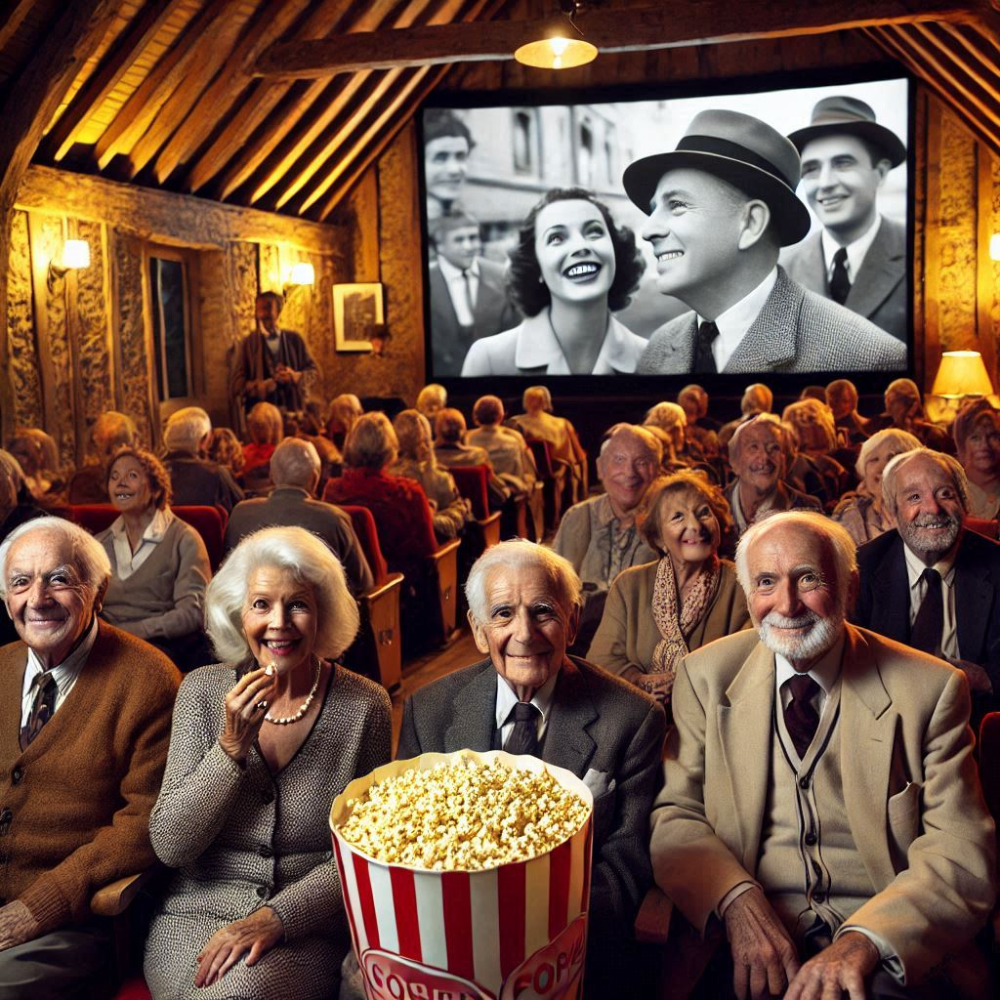

⬅️[Retour à l'accueil](../../README.md)

# Axes et Orientation Stratégiques

  

L’étude de marché combinée à l’analyse approfondie des KPI tirés des bases de données a permis de dégager une vision stratégique claire pour le projet du moteur de recommandation de films et pour la programmation adaptée de notre client.

Ces directions a suivre devront être prises en compte dans les réflexions et réalisations à venir.

## **Insights clés issus de l'Etude de Marché**

  

### **1. Public cible et comportements**
- **Adultes et seniors (60 % ou plus du public)** : Ils représentent le cœur de l’audience. Les seniors, en particulier, expriment une forte affinité pour des films français, comédies, drames historiques et indépendants.
- **Jeunes adultes (18-24 ans) et familles** : Ces groupes constituent des cibles complémentaires, sensibles aux films familiaux, blockbusters, animations et science-fiction. 

### **2. Démographie locale : un défi et une opportunité**
- **Population vieillissante et faiblement dense** : Avec 35 % de seniors et moins de 20 % de moins de 20 ans, le territoire subit un déclin démographique. Cependant, cette composition appelle une programmation adaptée aux seniors et des initiatives pour fidéliser les actifs.
- **Une base de retraités à valoriser** : Avec 40 % de retraités, une programmation culturelle riche et accessible pourrait transformer ce défi démographique en levier d’attractivité.

### **3. Fréquentation et attentes**
- Les **spectateurs réguliers** dominent, mais une conversion des spectateurs occasionnels en visiteurs assidus pourrait être obtenue grâce à une offre équilibrée entre blockbusters et événements culturels spécifiques.
- Les **films indépendants, d’auteur et documentaires** séduisent les amateurs, tandis que les **blockbusters** captent les spectateurs occasionnels, offrant un équilibre essentiel.

### 4. **Concurrence du streaming**
- Les seniors, moins enclins à utiliser les plateformes de streaming, représentent un public clé pour des expériences locales et immersives.
- **Proposer une alternative différenciée** via des projections exclusives, films d’auteur, documentaires ou événements thématiques permettra de concurrencer des plateformes comme Netflix.

---
## **Insights clés et recommandations issus de l'analyse des KPIs**

### **1. Critères basés sur les Genres de Films**

- **Genres principaux à privilégier** : Utiliser les genres les plus populaires dans la région comme critères primaires pour le moteur de recommandation. Par exemple, inclure des genres comme "drame", "comédie", "animation", et "familial" en priorité dans les filtres.
- **Subgenres** : Inclure des sous-catégories spécifiques pour affiner les recommandations. Par exemple, pour les films dramatiques, intégrer des sous-genres comme "drame historique" ou "drame romantique".
- **Genres moins populaires** : Laisser une marge pour les films moins populaires, mais potentiellement intéressants pour des segments spécifiques de l'audience, comme les films d'art et d'essai ou les documentaires.

### **2. Critères basés sur la Popularité et la Notoriété**

- **Films populaires** : Prioriser les films avec une note élevée sur TMDb ou IMDb, par exemple ceux avec une note de 7/10 ou plus.
- **Films avec un nombre élevé de votes** : Sélectionner les films ayant reçu un grand nombre de votes, car cela peut indiquer une reconnaissance plus large et une base de spectateurs plus diversifiée.

### **3. Critères basés sur la zone géographique**

- **Priorisation des grands producteurs mondiaux** : Sélectionner les films issus des zones géographiques clés en fonction de leur volume de production et de leur popularité.

  - États-Unis (Hollywood) pour les blockbusters.
  - Japon pour les films d’animation et les classiques.
  - Corée du Sud pour les thrillers et films à suspense.
  - Inde pour le genre spécifique Bollywood.
  - France pour le cinéma d’auteur et les comédies romantiques.

- **Diversité géographique** : Intégrer des films provenant de régions émergentes pour enrichir la base de recommandations, en privilégiant ceux ayant une forte reconnaissance critique.

- **Adaptation aux préférences locales** : Tenir compte de l’étude de marché pour prioriser les films correspondant aux goûts locaux : les films français pour le public cible.

### **4. Critères basés sur les Grandes Périodes du Cinéma**

- **Focus sur les périodes clés** :

  - Proposer une sélection de films iconiques de chaque grande période, particulièrement pour les spectateurs intéressés par les classiques.
  - Accorder une place importante aux films récents pour répondre aux goûts modernes et capter une audience jeune.

- **Mise en avant des chefs-d'œuvre** :

  - Prioriser les films ayant marqué leur époque grâce à leurs succès critiques et commerciaux.

- **Genres emblématiques par période** :

  - **Cinéma muet** : comédies visuelles, drames expressionnistes.
  - **Hollywood classique** : films noirs, westerns, comédies musicales.
  - **Années 1970-1990** : action, science-fiction, horreur.
  - **Contemporain** : blockbusters, films sociaux, animations numériques.

### **5. Critères basés sur les Acteurs et Réalisateurs**

- **Acteurs populaires** : Sélectionner les films mettant en vedette des acteurs ayant une forte popularité ou une base de fans locale.
- **Réalisateurs à succès** : Intégrer des films réalisés par des cinéastes ayant une réputation établie, notamment ceux dont les précédents films ont bien performé.

---

## **Orientation stratégique**

### **1. Développer une présence numérique humaniste et interactive**  

Créer un site interactif, centré sur la découverte de nouveaux horizons cinématographiques. Ce site intégrerait :  
- **Un système de recommandation personnalisé** basé sur les préférences des utilisateurs (genres, pays, âges, etc.).  
- **Des actualités cinématographiques et des coups de cœur** pour enrichir l'expérience culturelle.  
- **Une démarche de représentativité et d’engagement** : en intégrant la base de données Bechdel issue de Data for Good, nous mettons l'accent sur la diversité et la représentation des femmes dans les œuvres cinématographiques.  

L’objectif : faire du cinéma en Creuse **une plateforme culturelle engagée et connectée**, tout en proposant une expérience utilisateur immersive et inclusive.  

---  

### **2. Proposer une programmation équilibrée et engagée**
- **Pour adultes et seniors** : Renforcer l’offre en films français, comédies, drames historiques et documentaires explorant des sujets d’actualité.
- **Pour jeunes adultes et familles** : Organiser des soirées blockbusters, marathons d’animation ou événements thématiques autour de la science-fiction et du fantastique.
- **Focus sur le world cinéma** : Valoriser des films étrangers bien notés, permettant une ouverture culturelle et une découverte enrichissante.

### **3. Diversifier les expériences cinématographiques**
- Mettre en avant des projections spéciales : avant-premières, débats autour de documentaires engagés, ou rétrospectives de films cultes.  
- Intégrer une programmation humaniste, centrée sur des œuvres qui rapprochent les individus, stimulent la réflexion, et encouragent les échanges. 

### **4. Renforcer l’accessibilité et la fidélisation**
- **Tarifs adaptés** : Mettre en place des abonnements locaux pour seniors, familles et jeunes adultes.  
- **Campagnes ciblées** : Attirer les spectateurs occasionnels avec des offres thématiques ou groupées.
- Exploiter les **données locales** pour mieux personnaliser les campagnes de fidélisation.

### **5. Soutenir un cinéma de découverte**
Proposer des initiatives éducatives autour du documentaire, du cinéma indépendant et du patrimoine cinématographique, tout en conservant une accessibilité large via les blockbusters.

---

## **Synthèse : Un Cinéma Local Réinventé**
Le cinéma en Creuse est une opportunité unique pour **moderniser et dynamiser l’offre culturelle**, tout en restant profondément connecté à son public. En adoptant une stratégie fondée sur **l’humanisme, la découverte et une accessibilité renforcée**, il est possible d’aligner l’offre cinématographique sur les attentes spécifiques de chaque groupe démographique.
Cette transformation pourrait non seulement renforcer la fréquentation des salles, mais aussi faire du cinéma local un lieu de rencontres, d’échanges, et de découvertes culturelles enrichissantes.

⬅️[Retour à l'accueil](../../README.md)
