⬅️[Retour à l'accueil](../../README.md)

# Étude de Marché : Le Cinéma dans la Creuse

## Sommaire
- [Objectif et Méthodologie](#objectif-et-méthodologie)
- [Profil du Public Cinématographique en France](#profil-du-public-cinématographique-en-france)
- [Habitudes de Consommation de la VàD Payante](#habitudes-de-consommation-de-la-vàd-payante)
- [Analyse de la Structure de la Population en Creuse](#analyse-de-la-structure-de-la-population-en-creuse)
- [Le Cinéma dans la Creuse](#le-cinéma-dans-la-creuse--une-répartition-culturelle)
- [Conclusion et Recommandations Stratégiques](#conclusion--modernisation-et-dynamisation-de-loffre-cinématographique-en-creuse)

---

## Objectif et Méthodologie
### Objectif 

Cette étude explore le marché du cinéma en France, puis dans la Creuse, avec pour objectif de comprendre les habitudes de consommation locales et d'identifier des opportunités pour moderniser et dynamiser l'offre cinématographique.

Cette étape préliminaire nous permettra de définir une orientation adaptée pour la suite du projet.

### Méthodologie
1. **Collecte des données :**
   - Rercherche des sources : CNC, INSEE, enquêtes spectateurs.
   - Exploration de bases de données (statistiques régionales, historiques de programmation).
   - Requêtes API (ex. Allociné).
2. **Analyse des données :**
   - Nettoyage et structuration pour faciliter l’exploitation.
   - Visualisation des données avec Power BI.
3. **Études comparatives :**
   - Analyse concurrentielle (cinémas locaux vs plateformes de streaming).
   - Segmentation du public : âge, catégorie socio-professionnelle, fréquence.
4. **Livrables :** 
   - Rapport détaillé accompagné de graphiques pour appuyer les conclusions.
   - Définition des orientations stratégiques pour la suite du projet.

---

## Profil du Public Cinématographique en France

### Source
- **Origine des données** : CNC - Vertigo, enquête Cinexpert  
- **Population étudiée** : Spectateurs âgés de 3 ans et plus ayant fréquenté le cinéma au cours des 7 derniers jours.  
- **Période sélectionnée** : Année 2023 (les données sont disponibles de 2005 à 2023).  
- **Zone d’étude** : Nationale française.   

### Catégories de Spectateurs, Catégories socio-professionnelles

| **Catégories de spectateurs** | **Fréquence de fréquentation**                                                                                         |
|-------------------------------|-----------------------------------------------------------------------------------------------------------------------|
| Assidus                      | Au moins une fois par semaine                                                                                         |
| Réguliers                    | Au moins une fois par mois (moins d’une fois par semaine)                                                             |
| Occasionnels                 | Au moins une fois par an (moins d’une fois par mois)                                                                  |
| Habitués                     | Regroupent les assidus et les réguliers                                                                               |

| **Catégories socio-professionnelles** | **Description**                                                                                               |
|---------------------------------------|---------------------------------------------------------------------------------------------------------------|
| CSP+                                  | Agriculteurs exploitants, artisans, commerçants, chefs d’entreprises, cadres, professions intellectuelles supérieures, professions intermédiaires |
| CSP-                                  | Ouvriers, employés                                                                                           |
| Inactifs                              | Retraités, élèves, étudiants, personnes sans emploi                                                          |

### Remarque
Les données fournies dans l'étude permettent d’analyser la diversité des profils des spectateurs français, leur fréquence de fréquentation et les variations selon les catégories socio-professionnelles.  
Un fichier source contenant les données brutes est disponible dans l’espace partagé pour un approfondissement des analyses.

---

### Répartition des spectateurs par tranche d'âge

#### Selon la nationalité du Film

- Les adultes (25-49 ans) et les seniors (50 ans et plus) constituent le cœur du public (jusqu’à 80 % selon le type de film).
- Les films français et indépendants séduisent particulièrement les seniors, reflétant leur attachement à des œuvres culturelles de proximité.

#### Selon le genre du Film

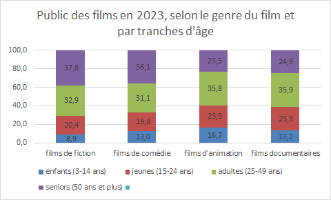

- Fiction et comédie : attirent plus les adultes et seniors (environ 70%).
- Animation et documentaires : attirent un peu moins, environ 60%.

#### Selon le nombre d'entrées par Film

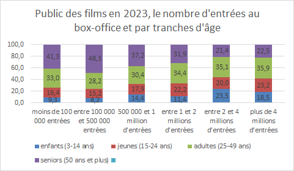

- 3 groupes distincts  
- Moins de 500 000 entrées - attirent le plus les adultes et seniors (environ 80%).  
- Peut-être lié à la langue du film, de préférence sans VOSTFR, ainsi que les films indépendants, d’auteurs, et films français.

#### Synthèse

**Prédominance des adultes et seniors**
-	Les adultes (25-49 ans) et les seniors (50 ans et plus) constituent le cœur du public cinématographique, représentant jusqu’à 80 % des spectateurs pour certains types de films (notamment français et indépendants).
-	Les genres comme la fiction et la comédie renforcent cette tendance, tandis que l’animation et les documentaires touchent un public légèrement plus jeune.
Importance des films français et indépendants pour les seniors
-	Les films à moins de 500 000 entrées, souvent indépendants ou en langue française sans sous-titres (VOSTFR), attirent majoritairement un public adulte et senior.

---

### Répartition des spectateurs par Activité Professionnelle

#### Selon la nationalité du Film

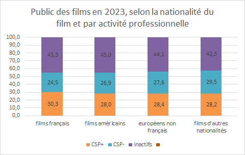

- Répartition équilibrée entre actifs et inactifs (inclus retraités et étudiants)

#### Selon le genre du Film

- Pas de tendance très nette.
- Les films d'animation attirent davantage les jeunes publics, indiquant un intérêt familial.

#### Synthèse

- Le public est **divisé à parts égales entre actifs et inactifs** (retraités, étudiants).
- Cette répartition limite l’analyse sur des opportunités spécifiques liées aux plages horaires, mais montre une diversité d’audience à exploiter.

---

### Répartition par fréquence de consommation

#### Selon la nationalité du Film

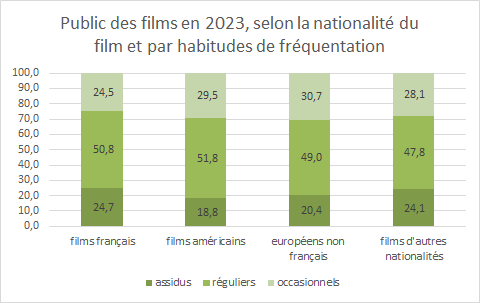

- Pas de différences significatives
- Une majorité globale de Réguliers
- Un marge de progression pour convertir les occasionnels en réguliers, les réguliers en assidus

#### Selon le genre du Film

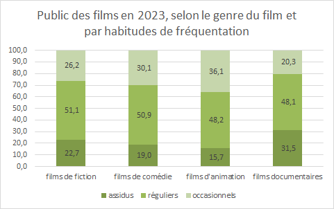

- Films d’animation : plus grosse part de clients occasionnels (36%) 
- Films documentaires : plus grosse part d’assidus (31%) 

#### Selon le nombre d'entrées par Film

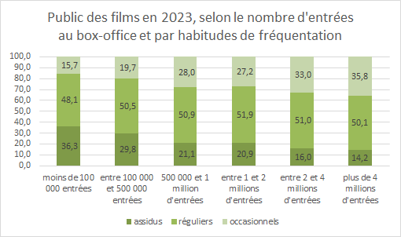

- Les films à moins de entrées font le meilleur score avec le public assidu
- Les films à plus de 4 millions d’entrées sont consommés par 36% du public occasionnel.

#### Synthèse

**Fréquence de consommation : marge de progression chez les occasionnels**
-	Les spectateurs réguliers dominent le paysage, mais les films d’animation attirent la plus forte proportion de clients occasionnels (36 %).
-	En revanche, les documentaires séduisent davantage les cinéphiles assidus, avec 31 % de spectateurs très fidèles.

**Segmentation par succès des films : une offre à diversifier**
-	Les blockbusters (plus de 4 millions d’entrées) touchent davantage les consommateurs occasionnels (36 %), tandis que les films à succès limité (< 500 000 entrées) sont plébiscités par les assidus.
-	Ces données soulignent l'importance d’équilibrer une programmation entre films grand public et œuvres plus spécifiques pour maximiser la portée et fidéliser des segments variés du public.

---

## Habitudes de Consommation de la VàD Payante

### Description des Données
- **VàD** : Vidéo à la demande  
- Les données analysées proviennent de la base « **CNC - Public VàD - données statistiques** » et couvrent une période allant de 2014 à 2023.
- L’objectif principal est d’**étudier le profil du public de la VàD ainsi que son mode de consommation**.

### Pénétration de la VàD

#### Selon la catégorie socio-professionnelle

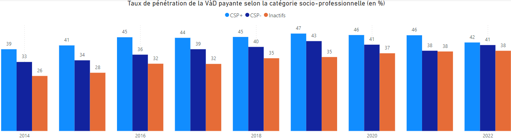

#### Selon l'âge

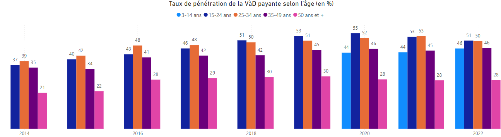

#### Synthèse

- Les Seniors sont moins impactés par le Streaming
- Tranche 15 > 49 ans : concurrence importante du Streaming  > à contrer en proposant les films "tendance", actuels
- Proposer des thématiques sous forme d'évènements (Nuit Saison 1 : Walking Dead par exemple)

### Les consommateurs de la VàD payante

#### Selon la catégorie socio-professionnelle

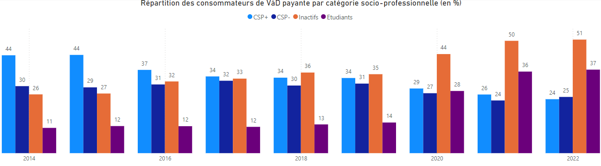

- Part des actifs en diminution
- Part des inactifs (et surtout étudiants) en forte augmentation
- Part faible (retraités et sans emploi)
- Etudiant inclus dans le % des inactifs

#### Selon l'âge

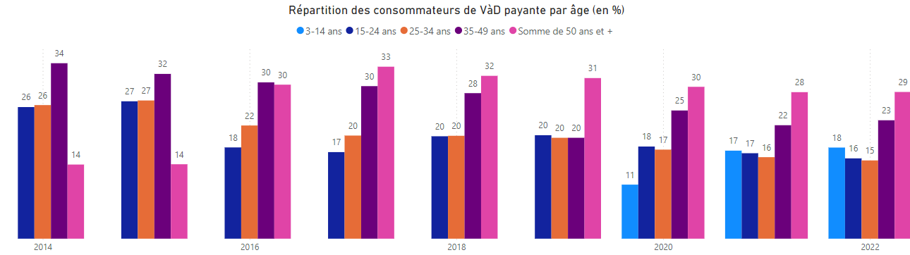

- La tranche 35-50 ans représente plus de 50% des consommateurs de VàD

### Utilisation de la VàD payante

#### Mode d'utilisation

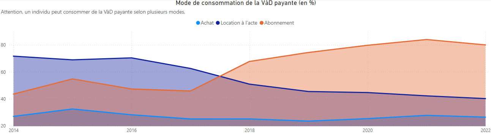

- Très nette diminution de la consommation de location (- 56%).
- A l’inverse, la consommation via abonnement à des plateformes a augmenté de manière inversement proportionnelle (+ 53%).
- Concernant les achats, la consommation reste stable (pas la même programmation).
- la concurrence principale au cinéma est l’abonnement / l’environnement de visionnage / la démocratisation des supports (tablettes, etc)

#### Fréquence d'utilisation

- *Intensif* : Au moins une fois par jour / *Assidu* : Au moins une fois par semaine
- *Régulier* : Au moins une fois par mois / *Occasionnel* : Moins d’une fois par mois

- La tendance de consommation s’est lissée avec le temps
- Consommation très occasionnelle au départ puis se rapproche de la tendance de consommation au cinéma

### Programmation des plateformes de VàD

#### Parts de marché

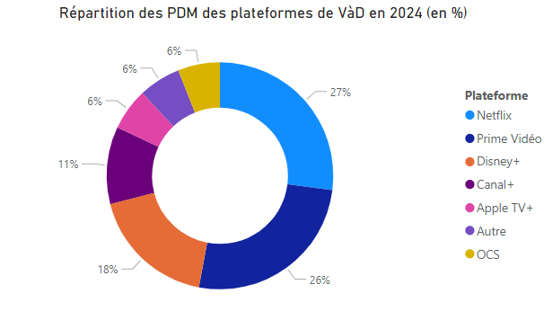

- Netflix et Prime Vidéo se partagent plus de la moitié des PDM, suivis de près par Disney+ qui connaît la plus grosse progression.
- **Cible et orientation** pour le cinéma d'auteur / cinéma Français

#### Répartition de la programmation

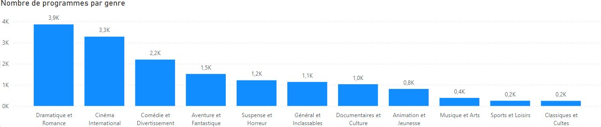

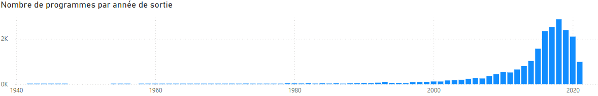

- Certains genres sont sur-représentés en comparaison à d’autres.
- Le catalogue comprend en majeure partie des programmes sortis depuis 2010.
- Il s’agit ici du catalogue Netflix, mais celui d’Amazon est sensiblement identique.
- Il y a donc **une grande période du cinéma qui est très peu représentée ce qui peut permettre à un cinéma physique de se démarquer de ces plateformes**.

---

## Analyse de la Structure de la Population en Creuse

### Évolution démographique depuis 1968.

*Sources : Insee, RP1967 à 1999 dénombrements, RP2010 au RP2021 exploitations principales*

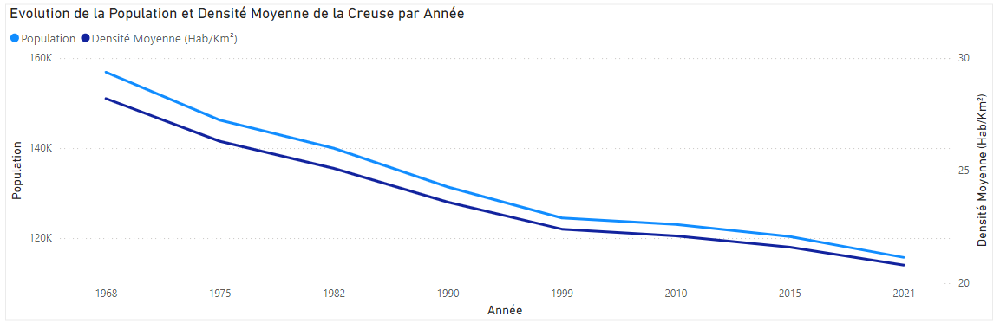

- Population de 115 702 habitants (2021), avec une densité moyenne de 20,8 hab/km² en baisse constante depuis plusieurs décennies.

### Répartition par âge.

*Source : Insee, RP2021 exploitation principale, géographie au 01/01/2024*

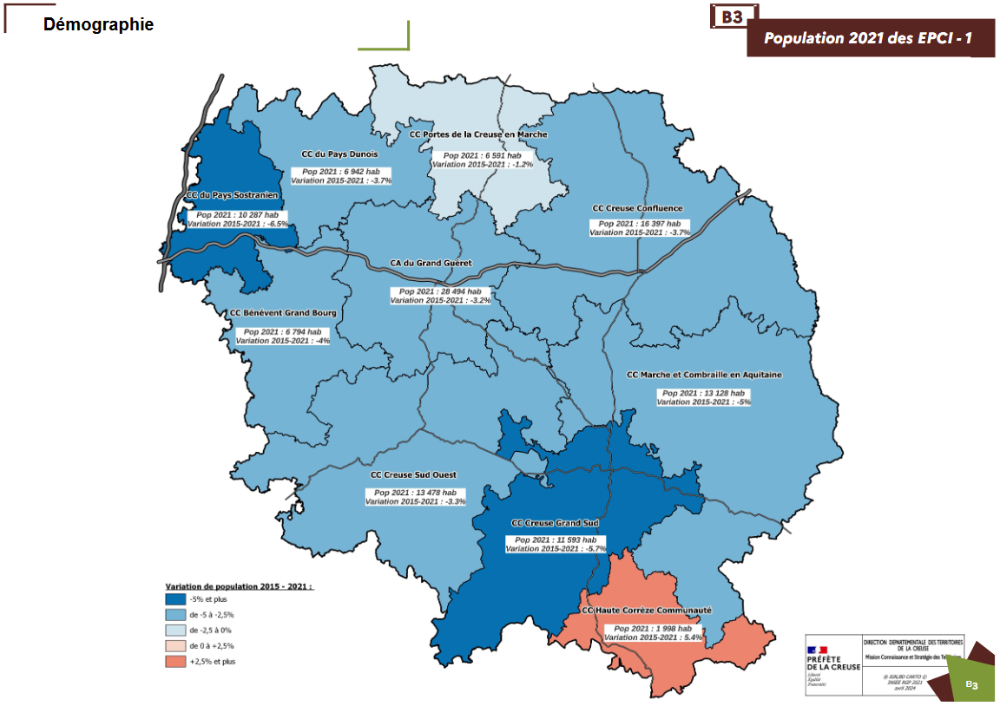

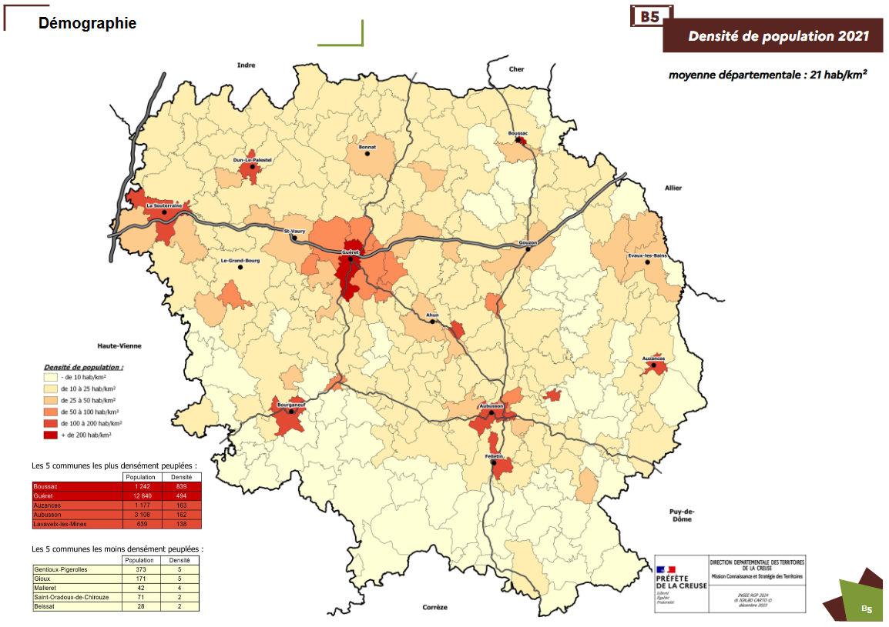

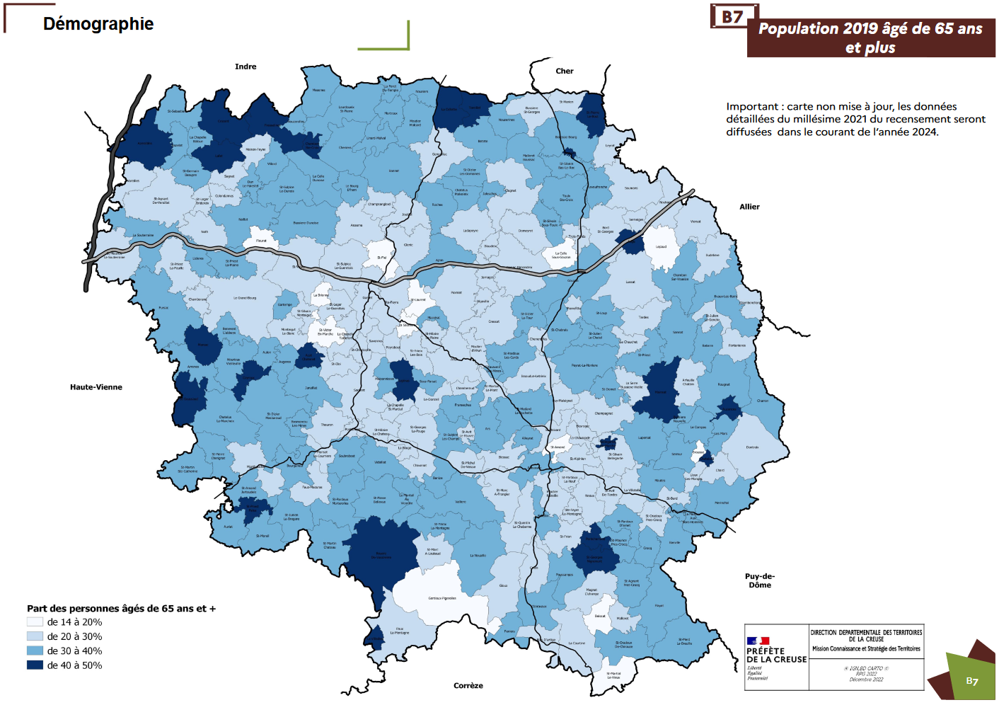

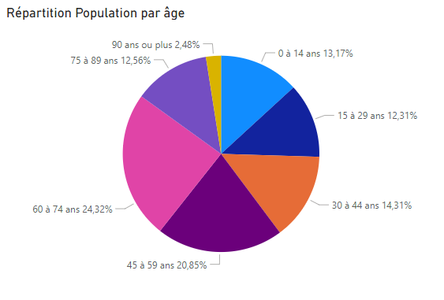

- Plus de 50 % de la population a plus de 45 ans, avec 40 % de retraités.
- Augmentation des inactifs (hors étudiants), nécessitant une programmation adaptée pour les seniors.

### Répartition par catégorie socio-professionnelle

*Source : Insee, RP2010, RP2015 et RP2021, exploitations complémentaires, géographie au 01/01/2024*

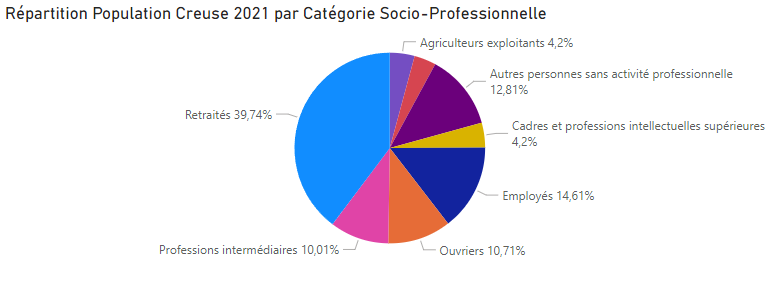

- 40% de retraités dans le département
- plus de 50% d'inactifs

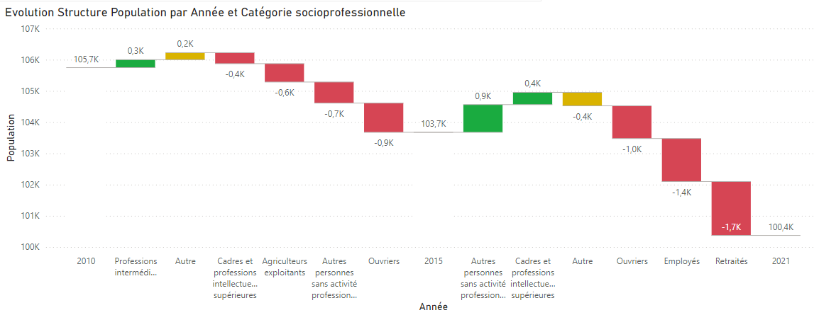

- Baisse du nombre des retraités
- augmentation du nombre de personnes sans activité professionnelles
- Baisse du nombre d’ouvriers et Employés

### Synthèse

**Implications pour un cinéma en Creuse** :

  

- *Cible principale : les seniors et les retraités*
    - Préférences : Films français, classiques, comédies accessibles et historiques, souvent en version française.
    - Programmation suggérée : Proposer des films à forte dimension culturelle ou patrimoniale, et organiser des séances en journée pour répondre à leurs disponibilités.

- *Cible secondaire : les familles*
    - Préférences : Films d’animation et comédies familiales.
    - Programmation suggérée : Prévoir des séances pendant les vacances scolaires et les week-ends, avec une communication adaptée aux jeunes parents.

- *Cible émergente : les jeunes actifs et étudiants*
    - Bien que peu nombreux, ils pourraient être attirés par des films événementiels, avant-premières, ou soirées thématiques (ciné-débat, cinéma indépendant).

- En conclusion, un cinéma en Creuse devrait miser sur **une offre variée mais centrée sur les seniors et les familles**, avec des films majoritairement en version française et des horaires adaptés à ces publics. Une **diversification occasionnelle pour attirer des publics plus jeunes ou spécifiques** peut également compléter l’approche.

---

## Le Cinéma dans la Creuse : Une Répartition Culturelle

  

Dans le département de la Creuse, l’offre cinématographique est répartie sur **sept cinémas**, chacun implanté dans des communes à taille humaine, avec une diversité de profils et de services.

### Carte des Cinémas en Creuse

  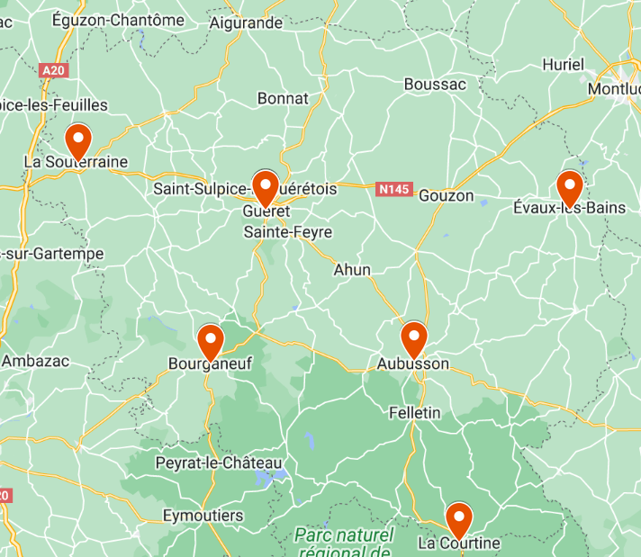

Ces établissements assurent une présence culturelle dans une région moins densément peuplée et répondent à une demande locale, bien que de manière restreinte et souvent avec des sites internet simples ou intégrés aux sites de mairie. Les infrastructures se divisent ainsi :

- **Cinéma Le Colbert à Aubusson** :
propose une programmation variée incluant des films récents et diversifiés. Bien que sa présence en ligne ne soit pas des plus développées, sa programmation inclut des films grand public et des productions françaises contemporaines. [Site du cinéma Le Colbert](https://www.cinemalecolbert.com/)

- **Cinéma Alpha à Évaux-les-Bains** : 
se distingue par une orientation vers des films d'auteur et régionaux. Cela offre une alternative aux films plus mainstream, mais sa visibilité en ligne est limitée, ce qui pourrait restreindre l'accessibilité pour un public plus large. [Page du cinéma Alpha](https://www.creuseconfluence.com/cinema)

- **Cinéma Le Sénéchal et Ciné Plus à Guéret** : 
parmi les cinémas les plus dynamiques du département. Ils proposent un large choix de films, allant des blockbusters aux films d’animation, ce qui en fait des points centraux pour le divertissement dans la région de Guéret. [Ciné Plus en Limousin](https://cineplusenlimousin.com/)

- **Cinéma Le Marchois à La Courtine** : 
bien qu’actif, semble être plus focalisé sur des projections ponctuelles ou des événements spécifiques, caractéristiques d’un cinéma de petite ville. (Facebook de la mairie)

- **Cinéma Le Régent à Bourganeuf** (Allociné) et **Cinéma Eden à La Souterraine** (Facebook du cinéma) :
proposent également des films populaires tout en s’ouvrant à des films d’animation et familiaux, favorisant ainsi une fréquentation large et multi-générationnelle.

### Répartition Géographique et Accessibilité

Dans le département de la Creuse, l'accessibilité des cinémas est marquée par leur dispersion géographique, rendant les distances entre eux parfois significatives. 

- Par exemple, **Aubusson**, où se situe le cinéma Le Colbert, est à environ **47 km** de Guéret, où se trouvent Le Sénéchal et Ciné Plus, soit près de **50 minutes en voiture**.  
- De même, le cinéma Eden à **La Souterraine** est à plus de **60 km** d'Évaux-les-Bains, où se situe le cinéma Alpha.  

Cette répartition illustre une offre culturelle qui, bien qu'adaptée à la faible densité de population, peut rendre l'accès à certaines salles contraignant pour les habitants éloignés. Une meilleure visibilité en ligne et une coordination des programmations pourraient compenser ces distances en renforçant l’attractivité des cinémas locaux.

### Opportunités d'Amélioration

La Creuse assure donc une couverture minimale pour le divertissement cinématographique, mais elle est marquée par une visibilité en ligne très inégale. Seul un des cinémas dispose d'un site véritablement engageant, les autres ayant soit des sites basiques, soit des pages intégrées aux sites des municipalités ou Facebook.

Ce manque de présence numérique souligne **une possible opportunité de modernisation et d’interaction accrue avec le public**. Cela pourrait être une porte d’entrée vers des **services innovants, notamment un système de recommandation et de personnalisation des programmes**.

---

## Analyse SWOT du marché cinématographique dans la Creuse

  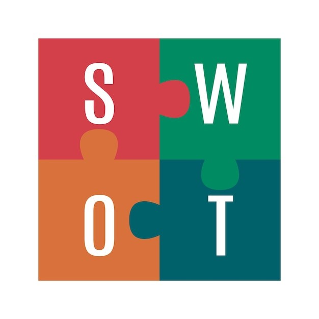

### Tableau SWOT

  

### Forces
- **Présence locale** : Les sept cinémas couvrent le département et offrent une accessibilité pour les habitants des villes et villages avoisinants.  
- **Diversité de la programmation** : Une programmation variée, des blockbusters aux films d’auteur, en passant par des films d’animation.  
- **Culture régionale** : Certains cinémas mettent en valeur le cinéma régional, attirant une audience intéressée par des productions locales.  

### Faiblesses
- **Présence en ligne limitée** : Seul un cinéma dispose d’un site attrayant ; les autres souffrent d’une faible visibilité numérique.  
- **Infrastructure modeste** : Certains cinémas proposent uniquement des projections ponctuelles ou événementielles, ce qui réduit la stabilité de leur fréquentation.  
- **Capacité de modernisation** : Le manque d'outils et d’infrastructures modernes limite l'engagement du public.  

### Opportunités
- **Digitalisation** : Créer un site web fonctionnel avec réservation en ligne et recommandations pourrait attirer un public plus large et fidéliser les spectateurs.  
- **Programmation personnalisée** : Introduire un système de recommandation pour inciter à découvrir des films adaptés aux goûts des spectateurs.  
- **Dynamisation de l’offre** : Organiser des événements spéciaux ou des projections thématiques pour diversifier les publics et renforcer l’image culturelle.  

### Menaces
- **Faible densité de population** : Une population peu dense rend difficile une fréquentation régulière suffisante.  
- **Concurrence des plateformes de streaming** : Les spectateurs privilégient souvent les plateformes en ligne si l’offre locale manque d’exclusivité ou d’interactivité.  
- **Manque de soutien financier** : Les ressources limitées des cinémas indépendants freinent leur capacité à investir dans la modernisation.  

---

### Analyse de la consommation et fréquentation du Cinéma dans la Creuse

*Source : « CNC - Exploitation - Données par Département » et couvrent une période allant de 2013 à 2023*

#### Indice de Fréquentation

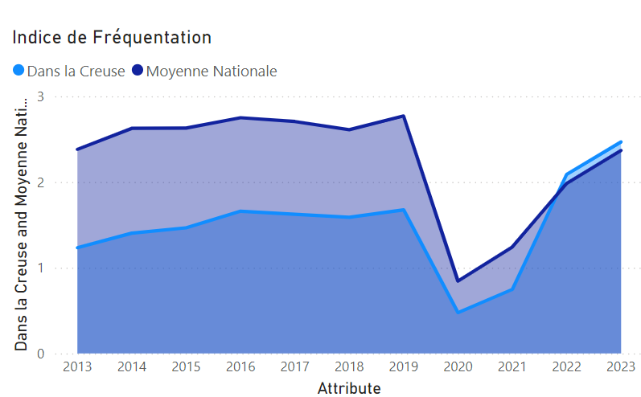

- *Indice de fréquentation* : Mesure de l’affluence dans les cinémas, comparant le nombre d’entrées locales à la moyenne nationale.
- L'indice de fréquentation a atteint le niveau de l'indice national, alors qu'avant le Covid, il était historiquement deux fois inférieur pendant de nombreuses années. Une nette progression s'est observée après le Covid, particulièrement dans la Creuse.

#### Nombre d'entrées

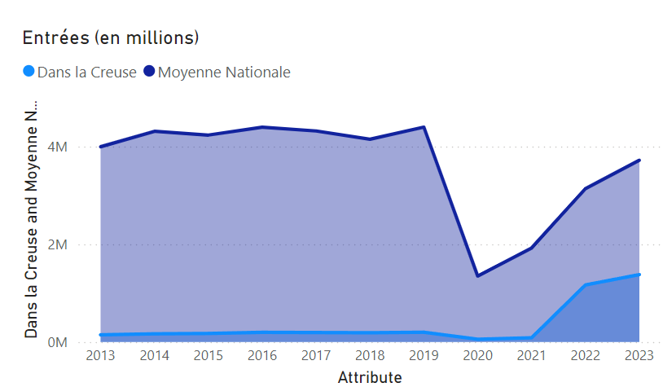

- La progression des entrées apparaît étroitement liée à l'augmentation de l'indice de fréquentation (voir graphique précédent).
- Multiplication par 7 du nombre d'entrées avant et après le Covid.

#### Taux d'occupation des fauteuils (taux de remplissage)

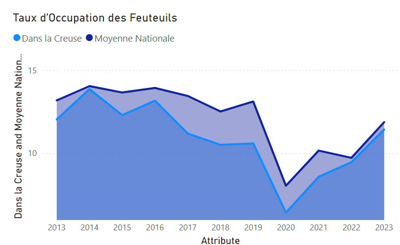

*Le taux moyen d'occupation des fauteuils est le rapport entre les entrées au cours de l'année et le produit entre le nombre de fauteuils et le nombre de séances. Il permet d'évaluer le " remplissage " des salles.*

- Baisse significative en 2020 liée à la crise COVID, suivie d’une reprise progressive atteignant presque la moyenne nationale en 2023.

#### Recettes : Revenus générés par la vente de billets

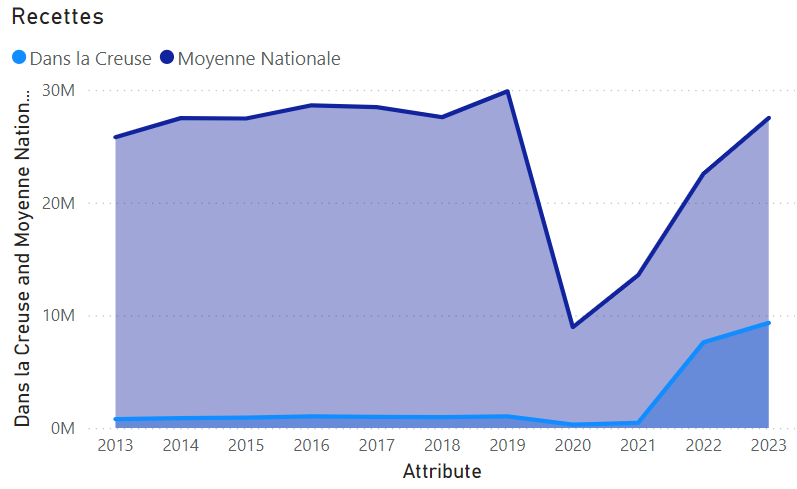

- Les recettes par entrée reflètent une augmentation corrélée au nombre d'entrées et aux hausses des tarifs nationaux, bien que l'impact soit moindre dans la Creuse en raison de la taille réduite des cinémas locaux.

#### Séances : Nombre total de projections organisées dans les cinémas

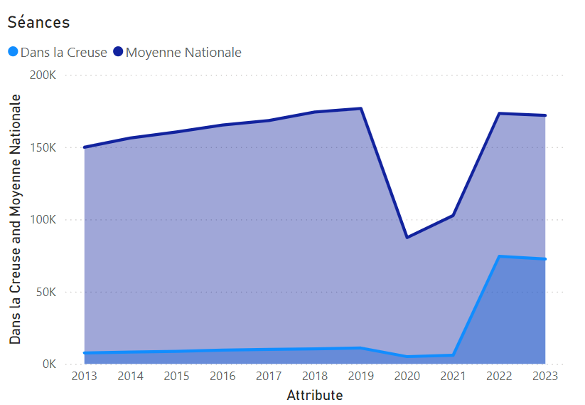

- Explosion de l’offre avec une quantité de séances beaucoup plus importante depuis 2021

#### RME (Revenu Moyen par Entrée) : Revenu moyen généré par billet vendu

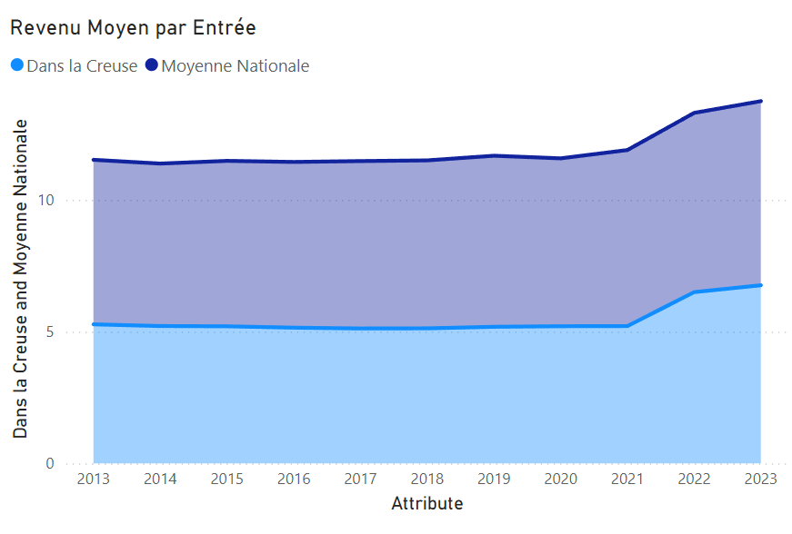

- RME = recettes / entrées
- Le RME reflète une légère augmentation progressive dans la Creuse, en phase avec la tendance nationale. Cette hausse peut s’expliquer par une augmentation des tarifs moyens des billets, bien qu’elle reste inférieure à la moyenne nationale en raison de spécificités locales  (infrastructures plus petites et des coûts adaptés.)

---

## Conclusion : Modernisation et Dynamisation de l’Offre Cinématographique en Creuse

L’étude montre que le cinéma en Creuse détient un potentiel significatif pour fidéliser et diversifier son public. La clé réside dans **une modernisation de l’offre, une meilleure intégration des outils numériques et une programmation capable de combiner authenticité, accessibilité, et engagement culturel**.

⬅️[Retour à l'accueil](../../README.md)
